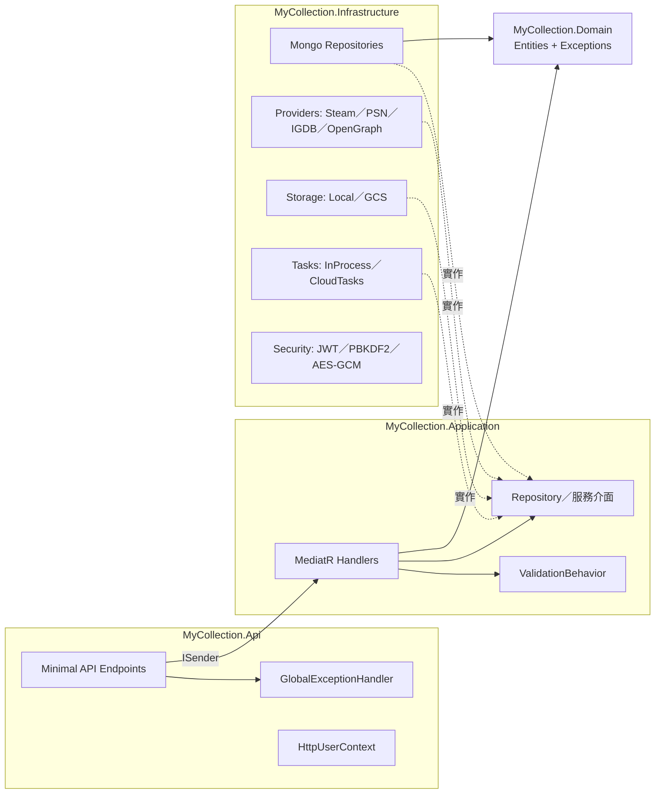
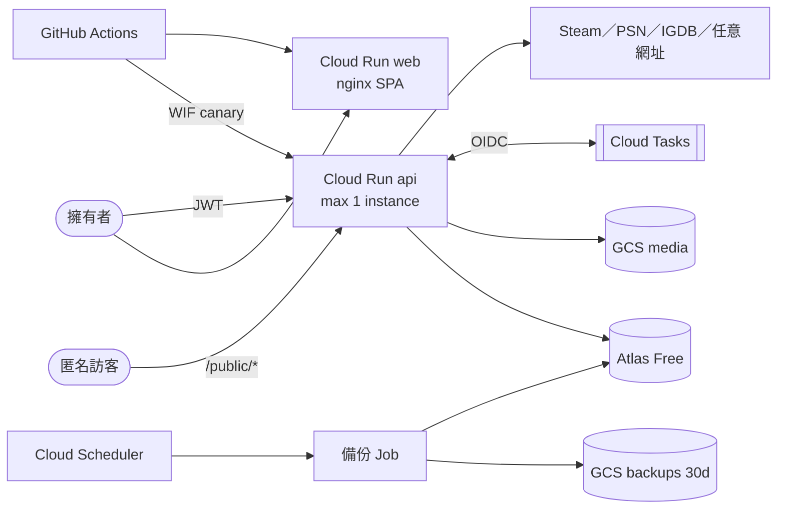

# 系統總覽

> 階段 3 整合文件。資料基準：commit `61b1f5d`，2026-09-26。
> 本文只做彙整，每個陳述都可追溯到 `00-inventory.md` 與模組文件（`11`–`17`）；細節與證據請見各連結。

## 系統目的

**MyCollection** 是一套個人收藏品管理系統，涵蓋實體遊戲、數位遊戲、音樂專輯、電影光碟、公仔模型與珍藏卡：
- 以「品類」定義動態欄位（schema），品項的 attributes 依該 schema 驗證。
- 從 Steam、PSN 同步遊戲庫，並以 Steam 商店（繁體中文）、IGDB 與 OpenGraph 補完 metadata。
- 挑選「精選」品項，組成首頁牆面（拼貼、焦點、成就、列表四種頁籤）。
- 以匿名分享連結對外公開精選或特定品類。

證據：
- 系統品類：`Infrastructure/Mongo/SystemCategoryDefinitions.cs`
- endpoint 群組：`00-inventory.md`「對外 API」
- 頁籤：ADR-0009；`web/src/app/features/showcase/showcase.component.ts`

**使用規模**：目前只有擁有者一人使用，未來改為邀請制（Q12）。然而程式碼中的註冊是完全開放的（`11-module-identity.md` I2）。

## 技術堆疊

| 層 | 技術 | 證據 |
|---|---|---|
| 後端 | .NET 10、ASP.NET Core Minimal API、MediatR 14（CQRS + `ValidationBehavior`）、FluentValidation 12 | `00-inventory.md`「方案結構」 |
| 資料 | **MongoDB 是唯一的資料庫**（正式環境為 Atlas Free，ADR-0011）；**沒有使用** SQL Server、PostgreSQL、Redis、EF Core | `00-inventory.md`「資料儲存」 |
| 檔案 | GCS（正式）／本機檔案系統，ImageSharp 輸出 WebP 三種尺寸 | `13-module-media-transfer.md` |
| 背景工作 | Cloud Tasks（正式）／行程內 channel（本機）；`BackgroundService` 下載精選圖片 | `15-module-ingestion.md`、`14-module-showcase-sharing.md` |
| 前端 | Angular 20.3 standalone + signals + zone.js，沒有 UI 元件庫，也沒有 NgRx | `16-module-web.md` |
| 基礎設施 | GCP：Cloud Run（api、web、備份 Job）、Artifact Registry、Secret Manager、Cloud Scheduler、Monitoring；Terraform 分 `bootstrap` 與 `runtime` 兩個 root | `17-module-platform-infra.md` |
| CI/CD | GitHub Actions，只有 `workflow_dispatch`；WIF 免金鑰；canary 40% 觀察後升到 100% | `17-module-platform-infra.md`「發布流程」 |
| 測試 | xUnit（`tests/MyCollection.Tests`，本次未讀）；Karma + Jasmine（31 個 spec，本次未讀） | `MyCollection.slnx`、`web/angular.json` |

## 方案分層

- 依賴方向：Api → Infrastructure → Application → Domain（`*.csproj` 的 `ProjectReference`）。
- 例外：`Domain` 直接依賴 `MongoDB.Bson`，`Application` 也有 `Common/BsonJson.cs`，持久化技術滲入了內層（`00-inventory.md`「資料儲存」觀察）。
- Application 按功能切資料夾（Auth、Categories、Items、Media、Sharing、Showcase、Ingestion、Transfer），endpoint 檔案與它一對一對應。

## 部署拓樸（正式環境）

完整的元件設定、服務帳號權限與告警見 `17-module-platform-infra.md`「部署拓樸」。本機以 `docker-compose.yml` 啟動 api 與 web，使用 Local storage 與 InProcess tasks，Mongo 由外部提供。

**環境差異（容易踩雷）**

| 行為 | 本機（compose／`dotnet run`） | 正式（Cloud Run） | 證據 |
|---|---|---|---|
| Sync 與 enrich | InProcess：sync 在 HTTP 請求內跑完；Steam enrich 走 channel | CloudTasks：全部進佇列，回應時 `Running` | `15-module-ingestion.md`「執行路徑決策」 |
| 檔案儲存 | 本機目錄 | GCS | `Infrastructure/DependencyInjection.cs` |
| 實例數 | 1 個行程 | 最多 1 個實例，會縮到 0；**canary 期間同時有 2 個 revision** | `17-module-platform-infra.md` P6 |
| 請求逾時 | 無 | 300 秒 | `runtime/services.tf` |

## 模組地圖

| 模組 | 文件 | 一句話 | 高嚴重度項目 |
|---|---|---|---|
| 1 Identity & Security | [11-module-identity.md](11-module-identity.md) | JWT + refresh rotation、PBKDF2、AES-GCM、`ScopedUserContext` | I1、I2 |
| 2 Catalog | [12-module-catalog.md](12-module-catalog.md) | 品類 schema、品項 CRUD、欄位改名 transaction | C1 |
| 3 Media & Transfer | [13-module-media-transfer.md](13-module-media-transfer.md) | 上傳、三種尺寸 WebP、私有串流、匯出與匯入 | M1、M2（推論） |
| 4 Showcase & Sharing | [14-module-showcase-sharing.md](14-module-showcase-sharing.md) | 精選牆、匿名分享、精選圖片背景下載 | S1、S2 |
| 5 Ingestion | [15-module-ingestion.md](15-module-ingestion.md) | 外部 provider、sync 與 enrich、Cloud Tasks 冪等與重試 | R1 |
| 6 Web | [16-module-web.md](16-module-web.md) | Angular SPA、攔截器鏈、URL 驅動狀態 | W1 |
| 7 Platform & Infra | [17-module-platform-infra.md](17-module-platform-infra.md) | 啟動、Mongo 基礎、Terraform、CI/CD、備份 | — |

橫切主題見 [03-cross-cutting.md](03-cross-cutting.md)，關鍵流程見 [02-data-flow.md](02-data-flow.md)，技術債彙整見 [90-tech-debt.md](90-tech-debt.md)。

## 架構決策紀錄（ADR）

`docs/adr/` 共 12 份。本次深讀了 0007、0008、0011、0012；其餘只依檔名與程式碼註解中的引用對照。

| ADR | 主題（依檔名） | 本文件的引用處 |
|---|---|---|
| 0001 | 品名由 enrich 擁有，不由 sync 擁有 | `15` 欄位擁有權 |
| 0002 | Steam 商店端點沒有官方文件 | `15` R-系列 |
| 0003 | enrich 端點有兩種回應語意 | `15` 執行路徑、`16` `awaitJob` |
| 0004 | PSN 同步的是獎盃標題，不是購買紀錄 | `15` |
| 0005 | 同一款遊戲在兩個平台上是兩筆品項 | — |
| 0006 | 「全部」檢視的平台篩選是寫死的白名單 | `16` catalog |
| 0007 | 精選的展示模式與拼貼牆不篩選 | `14`、`16` |
| 0008 | 存放位置永不公開、評分需選擇加入 | `14` 白名單、`13` M2 |
| 0009 | 精選頁籤是篩選器，不是版型選擇器 | `16` |
| 0010 | 庫存 URL 是真實來源，返回點是記憶 | `16` |
| 0011 | 低成本正式環境：Cloud Run + Atlas Free | `17` |
| 0012 | 欄位 key 是身分，改名必須明確 | `12` C1、欄位改名 |

## 整體評價

**優點**
- 決策理由直接寫在程式碼註解與 ADR 裡，可追溯性很高。
- 例外集中轉換；owner filter 強制在 repository 層套用；公開路徑使用獨立的白名單 DTO 與 reader。
- 背景作業的冪等設計：operationId 作為 task name、lease、partial unique index。
- 基礎設施採最小權限，沒有長期金鑰；備份腳本對機密的處理很細緻。

**系統性弱點**（詳見 `90-tech-debt.md`）
1. **整份覆寫、沒有並發控制**：C1、C2、M1、R11。Q18 已決定改為逐欄位合併寫入。
2. **匿名與開放的入口**：沒有速率限制（I1）、開放註冊（I2）、SSRF（R4）、公開頁全量查詢（S1）、attributes 全部公開（S2），可能還有 EXIF 外洩（M2）。
3. **單一實例承載所有工作**：`max 1` 加上 300 秒逾時，長請求、大記憶體工作與冷啟動都會直接變成對外失敗（P13、R2、M3、M4、S3）。
4. **可觀測性不足**：app log 可能沒有 severity（P2）、作業可能永遠停在 `Running`（R3），背景失敗大多無聲。
