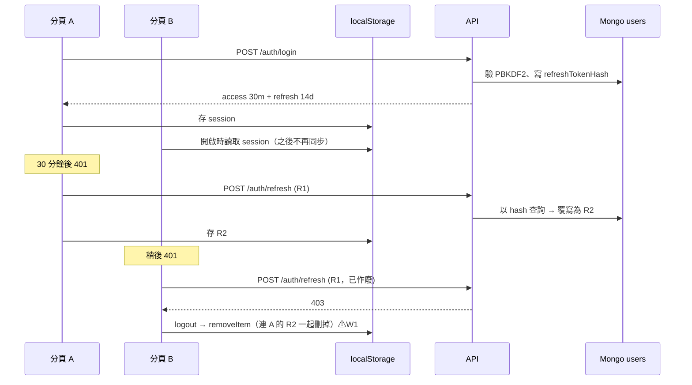
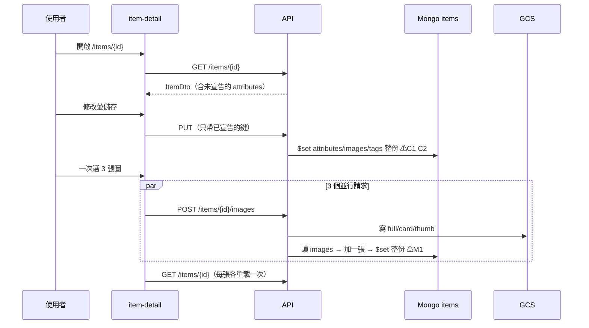
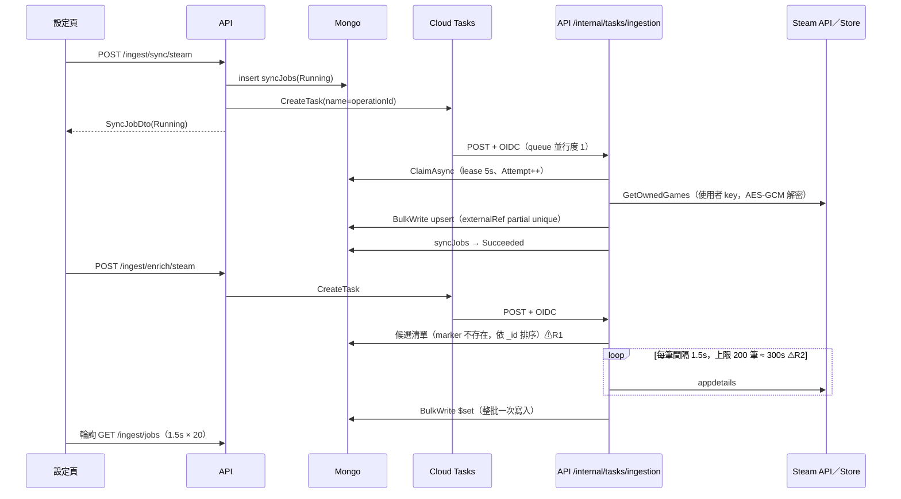
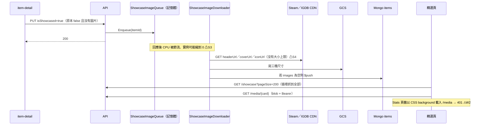
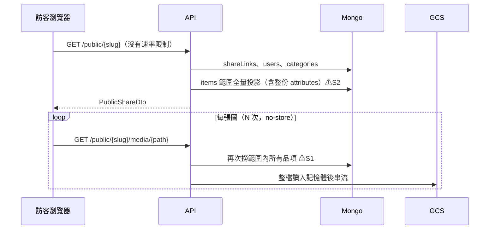

# 關鍵資料流

> 階段 3 整合文件。資料基準：commit `61b1f5d`。
> 這裡挑出五條最關鍵的業務流程；每條都標出目前已知的風險點（以 ⚠ 標示），完整證據在對應的模組文件。
> 圖中的 `API` 指 Cloud Run `mycollection-api`，`Mongo` 指 Atlas 上的 `mycollection` database。

## 1. 登入與 token 換發（多分頁）

- 同一個分頁內的並行換發會共用一個 promise（`AuthService.refresh`）。跨分頁沒有任何協調，而後端每個帳號只有一組 refresh token（I11），換發也不是原子操作（I5）。
- 登出只清除前端狀態，伺服器端的 refresh token 仍然有效（I4）。
- 證據：`16-module-web.md` W1；`11-module-identity.md`「關鍵流程」、I4、I5、I11

## 2. 編輯品項並上傳多張圖片

- **C1**：未宣告屬性在第一次儲存時被刪除，違反 ADR-0012 §三。
- **C2**：若在背景 enrich 或 sync 寫入之後，用舊表單儲存，會覆寫那些結果。
- **M1**：並行上傳時，最後寫入的會蓋掉其他人，最後只剩一張，其餘檔案成為孤兒。
- 三者同源：都是「讀取 → 修改 → 整份 `$set`」，沒有版本控制。Q18 已決定改為逐欄位合併寫入，陣列改用 `$push`／`$pull`。
- Date 欄位在這條路徑上會從 BSON DateTime 變成字串並失去時間（C3）。
- 上傳的 EXIF 可能原樣保留（M2，推論）。
- 證據：`12-module-catalog.md`「編輯品項並儲存」；`13-module-media-transfer.md`「一次選多張圖上傳」

## 3. Steam 同步與批次補完（正式環境）

- **冪等機制**：以 task name 去重、以 lease 搶佔作業；sync 以 `(ownerId, provider, externalId)` 的 partial unique index 做 upsert。
- **欄位擁有權**：sync 只擁有 provider 欄位，使用者欄位用 `$ifNull` 保護；`name` 由 enrich 擁有；`FillOnlyIfAbsent` 為軟寫入。
- **失敗路徑**：
  - Cloud Tasks 自己的重試次數用完時，作業會永遠停在 `Running`（R3）。
  - 候選清單沒有依 provider 過濾，可能卡在同一批（R1）。
  - `/ingest/fetch` 的 OpenGraph 抓取是 SSRF 入口（R4）。
- 證據：`15-module-ingestion.md`「關鍵流程」A、B 與「欄位擁有權」

## 4. 設為精選 → 背景下載圖片 → 精選牆

- 下載失敗只記 warning，不重試，也沒有重新產生的入口；唯一的方法是取消精選再重新勾選（S3、Q17）。
- 失敗時精選牆會退回熱連結第三方 CDN（S7）。
- 證據：`14-module-showcase-sharing.md`「精選圖片背景下載」；`16-module-web.md` W2

## 5. 匿名瀏覽公開分享頁

- **授權邊界**：匿名路徑不注入 `IUserContext`，owner 取自 `ShareLink.OwnerId`；媒體路徑必須屬於範圍內的品項，副檔名也必須是 `.webp`；過期連結回 404。
- **公開可讀的內容**超出 DTO 所提供的範圍：原尺寸圖（S8）可能帶有 EXIF（M2），attributes 整份公開（S2）。
- 所有流量都落在同一個 `max 1` 實例上，與 P13 疊加時，外部訪客也可能把服務打到沒有可用實例。
- 證據：`14-module-showcase-sharing.md`「匿名瀏覽分享頁」與「授權邊界」

## 資料儲存對照表

MongoDB 是唯一的資料庫。SQL Server、PostgreSQL、Redis 在本 repo 中**都沒有使用**（`00-inventory.md`「資料儲存」）。

| 資料 | 儲存位置 | 寫入者 | 讀取者 | 一致性與交易 | 證據 |
|---|---|---|---|---|---|
| `users` | Mongo | Register、Login、Refresh handler | JWT 流程、公開頁（顯示名稱） | 單文件；refresh 以 `_id` 無條件覆寫（I5） | `11` 資料存取 |
| `categories` | Mongo | 品類 CRUD、欄位改名、`SystemCategorySeeder`（每次啟動） | 品項驗證、sync／enrich、公開頁 | 改名是**全案唯一的多文件 transaction**；其餘單文件，沒有並發控制 | `12` 資料存取、`17` P3 |
| `items` | Mongo | 品項 CRUD、上傳與刪除圖片、sync（BulkWrite upsert）、enrich（BulkWrite `$set`）、精選圖片下載（條件式 `$push`） | 庫存、精選、公開頁、匯出 | 單文件，但 attributes 與 images 是整份覆寫（C1、C2、M1）；sync 與 enrich 靠欄位擁有權區隔 | `12`、`13`、`14`、`15` 資料存取 |
| `shareLinks` | Mongo | 建立與刪除分享 | 公開頁（不套 owner filter） | 單文件，slug 唯一索引 | `14` 資料存取 |
| `externalAccounts` | Mongo | 綁定與解除綁定（憑證以 AES-GCM 加密） | sync | `(ownerId, provider)` 唯一，upsert | `15` 資料存取、`11` I10 |
| `syncJobs` | Mongo | API（建立）、executor（claim、完成、重試） | 設定頁、前端輪詢 | `ClaimAsync` 原子；`UpdateAsync` 用 ReplaceOne（R11） | `15` 資料存取 |
| 圖檔（full、card、thumb `.webp`） | GCS（正式）／本機 | 上傳、精選圖片下載、匯入 | `/media`、`/public/.../media`、匯出 | 與 DB 之間沒有交易（M6）；刪除品項不刪檔（C5）；**沒有備份**（P1） | `13`、`17` P1 |
| 背景作業佇列 | Cloud Tasks（正式）／行程內 channel | enrich、sync handler | `/internal/tasks/ingestion` | Cloud Tasks 至少一次投遞，以 task name 去重 | `15` |
| 精選下載佇列 | 行程記憶體 | 品項更新 | `ShowcaseImageDownloader` | 行程重啟即遺失（S3） | `14` |
| 節流狀態、Twitch token | 行程記憶體（singleton） | providers | providers | canary 期間會分成兩份（P6） | `15`、`17` P6 |
| Session | 瀏覽器 localStorage | `AuthService` | `AuthService` | 跨分頁不同步（W1） | `16` |
| 庫存返回點 | 瀏覽器 sessionStorage | `CatalogReturnPointService` | 同上 | 讀回時做形狀驗證 | `16` |
| Mongo 備份 | GCS backups | 每日 Cloud Run Job | 還原演練（手動） | `ifGenerationMatch=0`，保留 30 天 | `17`「備份與還原」 |
