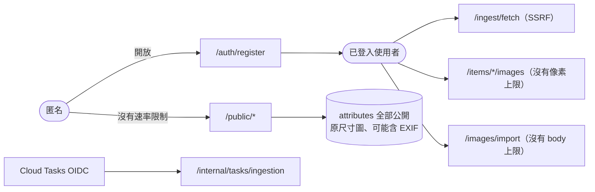

# 橫切關注點

> 階段 3 整合文件。資料基準：commit `61b1f5d`。每一節先描述現況，再列出相關的風險 ID（完整內容見 `90-tech-debt.md`）。

## 1. 認證與授權

### 認證

| 面向 | 現況 | 證據 |
|---|---|---|
| Access token | JWT HS256，30 分鐘；驗證 issuer、audience、簽章、期限，`ClockSkew` 30 秒；`MapInboundClaims=false` | `Api/Program.cs`；`Infrastructure/Security/JwtTokenService.cs` |
| Refresh token | 48 bytes 隨機值，資料庫只存 SHA-256，14 天，每次換發都輪替；**每個帳號只有一組** | `11-module-identity.md` 職責 2、I11 |
| 密碼 | PBKDF2-SHA256，210k 次迭代，迭代次數存在雜湊字串裡；登入失敗以 `DummyHash` 讓兩條路徑耗時一致 | `Pbkdf2PasswordHasher`、`LoginCommandHandler` |
| 前端保存 | `localStorage`；同一分頁內共用換發 promise，跨分頁不同步 | `web/src/app/core/auth.service.ts` |
| 機器對機器 | Cloud Tasks 以 `task-invoker` 服務帳號的 OIDC token 呼叫 `/internal/tasks/ingestion`，由 `ICloudTaskAuthenticator` 自行驗證 | `15-module-ingestion.md`；`runtime/tasks.tf` |
| 部署身分 | GitHub OIDC → WIF（綁 repo、master、`workflow_dispatch`） | `bootstrap/wif.tf` |

相關風險：I1（沒有速率限制）、I2（開放註冊）、I3（localStorage + 沒有 CSP）、I4（沒有登出 API）、I5（換發不是原子操作）、W1（多分頁互相登出）。

### 授權

- **Owner 隔離在 repository 層強制套用**：所有 `Mongo*Repository` 從 `IUserContext.UserId` 取得 owner filter，handler 不需要自己帶條件。
  證據：`11-module-identity.md` 職責 5；`15-module-ingestion.md`「使用者身分在背景路徑的切換」
- **`ScopedUserContext`**：HTTP 請求讀 JWT 的 `sub`；背景作業在 claim 之後 `Set(ownerId)`。判斷延後到**存取當下**才做。
  證據：`Api/Program.cs` 註解
- **刻意不套 owner filter 的例外**只有兩處，都用獨立介面隔開：
  - `IBackgroundSyncJobRepository`，只供受 OIDC 保護的 executor 使用。
  - `IShareLinkRepository.GetBySlugAsync`，公開頁使用。
  證據：`15` 與 `14` 的授權邊界段落
- **匿名公開路徑**：不注入 `IUserContext`，改用 `IPublicCatalogReader` 並明確傳入 owner；回應使用白名單 DTO `PublicItemDto`；媒體路徑必須屬於分享範圍，副檔名也必須是 `.webp`。
  證據：`14-module-showcase-sharing.md`「授權邊界」
- **沒有角色或權限模型**：只分「已登入的擁有者」與「匿名」兩種身分。系統品類由 `OwnerId = null` 表示，並拒絕修改。
- 相關風險：S2（attributes 全部公開）、S8（公開可讀原尺寸圖）、M2（EXIF，推論）、S9（Category 範圍不檢查品類歸屬）。

## 2. 錯誤處理

- **唯一的轉換點**：`GlobalExceptionHandler` 把例外對應成 RFC 9457 ProblemDetails：
  - 400：驗證失敗、圖片或封存檔無效
  - 403：Forbidden
  - 404：NotFound
  - 409：Conflict、無法解密的憑證
  - 502：Provider 失敗
  - 500：其他例外，而且不外洩訊息
  各層都不寫 try-catch。
  證據：`17-module-platform-infra.md`「錯誤處理」
- **驗證**：集中在 MediatR `ValidationBehavior`，handler 內不再做防禦性檢查。
  證據：`Application/Common/ValidationBehavior.cs`
- **前端**：`errorInterceptor` 把 ProblemDetails 轉成 toast，元件以 `IGNORE_HANDLED_BY_INTERCEPTOR` 表示錯誤已處理；401 交給 `authInterceptor`。
  證據：`16-module-web.md`「HTTP 攔截器鏈」
- **背景作業**：錯誤寫入 `syncJobs.error`，由 executor 決定要重試還是結束。
  證據：`15-module-ingestion.md`「關鍵流程」B
- 相關風險：
  - R5：`syncJobs.error` 與 502 的 `detail` 直接帶出原始的例外或上游訊息。
  - I7：登入失敗回 403，而不是 401。
  - W3、W8：前端把錯誤誤報成「空狀態」或「連結不存在」。

## 3. Logging 與監控

| 面向 | 現況 | 證據 |
|---|---|---|
| 應用程式 log | 預設的 simple console logger，寫到 stdout；沒有結構化輸出，也沒有自訂 scope 或 correlation id | `Api/Program.cs`、`appsettings.json` |
| 等級 | 5xx 用 `LogError`（含例外），4xx 用 `LogInformation`；精選下載失敗用 `LogWarning` | `GlobalExceptionHandler`；`ShowcaseImageDownloader` |
| 平台 log | Cloud Run request log 內建 status、latency、trace | 使用者提供的 log 樣本（Q23） |
| 告警 | api 或 web 的 5xx 次數 > 0（5 分鐘對齊）；備份 Job 的 `severity>=ERROR`；兩級預算 | `runtime/alerts.tf`、`backups.tf`、`bootstrap/budget.tf` |
| Canary 判定 | 新 revision 的 `severity>=ERROR` 或 status ≥ 500 | `.github/scripts/rollout-cloud-run.sh` |
| 機密遮蔽 | 備份與還原腳本會遮蔽 URI 中的帳密 | `infra/backup/entrypoint.sh` |

相關風險：
- P2（推論）：app log 沒有 severity，canary 與告警都看不到應用程式的錯誤。
- R3：作業停在 `Running`，沒有任何告警。
- S3：精選圖片下載失敗，沒有任何告警。
- P13：出現「no available instance」。
目前真正有告警涵蓋的只有「使用者看得到的 5xx」與「備份失敗」。

## 4. 設定與機密管理

- **Options pattern**：`Mongo`、`Jwt`、`Storage`、`SecretProtection`、`Steam`、`Igdb`、`Psn`、`Tasks` 各自一個 section，在 `AddInfrastructure` 統一 `Configure`。
  證據：`Infrastructure/DependencyInjection.cs`
- **設定錯誤盡早失敗**：Storage 缺 bucket、CloudTasks 缺參數、不支援的 provider，都會在 DI 註冊時拋例外。但 JWT 與保護金鑰要到第一次使用時才失敗（I8）。
- **依設定切換實作**：Storage 在 Local 與 Gcs 之間切換，Tasks 在 InProcess 與 CloudTasks 之間切換，IGDB 缺憑證時整組不註冊，前端也跟著隱藏入口。
- **機密來源**：

| 環境 | 來源 | 證據 |
|---|---|---|
| 本機開發 | user secrets（`UserSecretsId`）；`appsettings.Development.json` 內有開發用的 JWT 與保護金鑰，值為 `<REDACTED>`，並受 git 追蹤（Q3） | `Api/MyCollection.Api.csproj` |
| docker-compose | `.env`（`.env.example` 只有 placeholder），compose 以 `:?` 強制要求必填 | `docker-compose.yml`、`.env.example` |
| 正式 | Secret Manager 的 `secret_key_ref`（`latest` 版本）；備份 Job 以 volume 掛載 | `runtime/services.tf`、`backups.tf` |
| 前端 | 不含機密；`config.js` 只有 `apiBase` | `web/runtime-config.template.js` |

- **外部使用者憑證**（Steam key、PSN NPSSO）以 AES-256-GCM 加密後存入 Mongo。
  證據：`11-module-identity.md` 職責 4
- 相關風險：I10（沒有 AAD 或金鑰版本）、R6（Steam key 放在 query string）、R7（寫死的 PSN client 憑證）、P10（Terraform 預設值含個人信箱）。

## 5. 背景工作

| 工作 | 機制 | 持久性 | 重試 | 證據 |
|---|---|---|---|---|
| Sync 與 enrich（正式） | Cloud Tasks → `/internal/tasks/ingestion` → `IngestionOperationExecutor` | 持久（佇列） | 佇列最多 5 次，退避 10s 到 300s；程式內也有 `MaxAttempts = 5`（R10） | `15-module-ingestion.md` |
| Sync 與 enrich（本機） | `InProcessIngestionTaskDispatcher` + `IngestionTaskWorker`；sync 直接在請求內跑完 | 行程記憶體 | 無 | 同上 |
| 精選圖片下載 | `ShowcaseImageQueue`（unbounded channel）+ `ShowcaseImageDownloader` | 行程記憶體 | 無 | `14-module-showcase-sharing.md` |
| Mongo 備份 | Cloud Scheduler 02:00 → Cloud Run Job | 平台 | Job `max_retries = 1` | `runtime/backups.tf` |

- **Cloud Run 的限制**：`cpu_idle = true` 會在回應送出後節流 CPU；`min = 0` 會縮到 0；請求逾時 300 秒。依賴「回應之後繼續在行程內工作」的設計（S3）在這個環境下不可靠。長時間作業也受 300 秒限制（R2、M4）。
- **冪等**：task name 就是 operationId；lease 以 `FindOneAndUpdate` 原子取得；sync upsert 依靠 partial unique index。

## 6. 韌性、外部呼叫與速率

- **外部 HTTP**：`AddStandardResilienceHandler` 設定重試、逾時與斷路器，逐一調整：
  - Steam 與 PSN 重試 3 次。
  - IGDB 重試 2 次，401 由 provider 自己換 token 後重送。
  - Steam 商店刻意不重試，改由自訂節流器控制。
  證據：`Infrastructure/DependencyInjection.cs`；`15-module-ingestion.md`「外部呼叫、節流與重試」
- **自我節流**：`SteamStoreRateLimiter` 每筆間隔 1.5 秒，`IgdbRateLimiter` 每筆間隔 250 毫秒。兩者都是行程內的 singleton（P6）。
- **對內速率限制：沒有**。全 repo 沒有使用 `AddRateLimiter`，匿名端點與認證端點都沒有保護（I1、S1）。
- 相關風險：R8（POST 也會被重試）、R9（重試不經過節流器）、R4（SSRF）。

## 7. 並發與交易

- **唯一的多文件交易**：欄位改名（`MongoCategoryFieldRenamer`，需要 replica set）。
- **其餘都是單文件寫入，而且沒有任何樂觀並發控制**：沒有 version 欄位，也不比對 `updatedAt`。
- **原子操作只出現在少數刻意設計的地方**：job claim、精選圖片的條件式 `$push`、sync upsert。
- 相關風險：
  - C1、C2、M1、R11：整份覆寫。Q18 已決定改為逐欄位合併寫入。
  - C10：刪除品類與改名的競態。
  - I5：換發競態。
  - W1：多分頁競態。
  證據：`02-data-flow.md` 流程 2；`12-module-catalog.md`「資料存取」

## 8. 快取

- **伺服器端沒有任何快取層**：沒有 Redis，也沒有 `IMemoryCache`。唯一的記憶體快取是 Twitch token。
- **HTTP 快取**：
  - 私有媒體：`private, max-age=300`
  - 公開媒體：`no-store`（S1 的放大因子）
  - Web 靜態資源：`public, immutable, 1y`
  - `index.html`：`no-cache`
  - `config.js`：`no-store`
  證據：`13-module-media-transfer.md` 對外介面；`14-module-showcase-sharing.md`；`web/nginx.conf`

## 9. 資料與 schema 演進

- MongoDB 沒有 migration 機制。每次啟動時會建立索引（冪等），並以 `$set` 覆寫 6 個系統品類的定義。這兩個動作發生在 canary 之前，而且不會隨回滾復原（P3）。
- **全域序列化慣例**：camelCase、`IgnoreExtraElements`、enum 存字串、`Decimal128`。`UtcOnlyDateTimeSerializer` 在寫入時拒絕非 UTC 的時間。
  證據：`Infrastructure/Mongo/MongoConventions.cs`
- 品類 schema 的演進規則見 ADR-0012：key 是身分，改名必須明確，撤回宣告時不刪值。然而目前的實作在後續編輯時會刪值（C1）。
- 相關風險：C3（Date 欄位型別漂移）、C6（改型別時不遷移既有值）、C4（text index 沒有指定語言）。

## 10. 安全邊界總覽

- 從「完全匿名」到「能打 SSRF 與耗盡資源的端點」只隔著一個開放的註冊（I2）。這是目前最短的攻擊路徑。
- 改為邀請制之後，S4、M3 的嚴重度會跟著調整（`14` 與 `13` 已註記）。
- 前端防線：沒有 CSP（I3、P9）；模板中沒有 `innerHTML` 或 `bypassSecurityTrust*`（`16-module-web.md` W10）。
