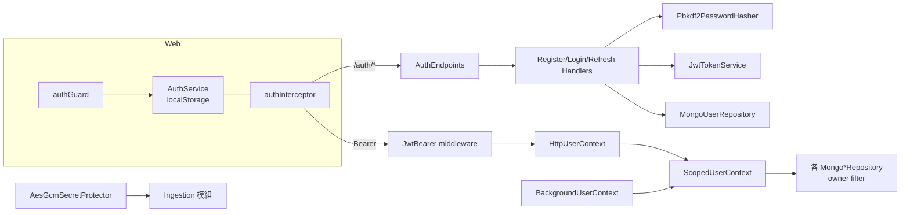
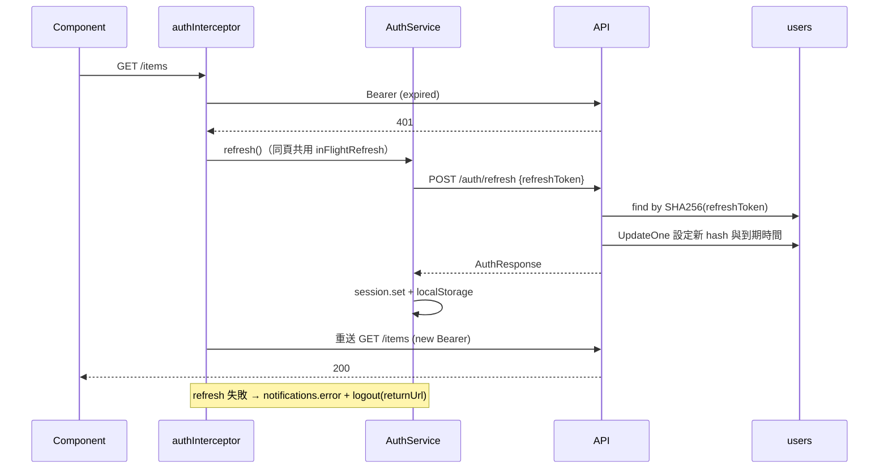

# 模組：Identity & Security

> 階段 2，模組 1。盤點日期 2026-09-26（commit `61b1f5d`）。
> 範圍：`Api/Endpoints/AuthEndpoints.cs`、`Api/HttpUserContext.cs`、`Api/Program.cs`（認證相關段落）、`Api/GlobalExceptionHandler.cs`、`Application/Auth/*`、`Application/Common/{IUserContext,BackgroundUserContext,ITokenService,IPasswordHasher,ISecretProtector,ValidationBehavior}.cs`、`Infrastructure/Security/*`、`Infrastructure/Mongo/MongoUserRepository.cs`、`Domain/Entities/User.cs`、`Domain/Exceptions/DomainExceptions.cs`；前端 `web/src/app/core/{auth.service,auth.interceptor,auth.guard}.ts`。
> 以下路徑省略 `src/MyCollection.` 前綴。

## 職責

1. **帳號**：註冊、登入。email 以 trim + 小寫正規化，並有唯一索引。
   證據：`Application/Auth/RegisterCommand.cs`、`LoginCommand.cs`；`Infrastructure/Mongo/MongoUserRepository.cs` → `Normalise`；`MongoIndexInitializer`（`ux_users_email`）
2. **Token**：簽發 access token（JWT HS256，預設 30 分鐘）與 refresh token（48 bytes 隨機值，資料庫只存 SHA-256，預設 14 天，每次換發都輪替）。
   證據：`Infrastructure/Security/JwtTokenService.cs`、`JwtOptions.cs`
3. **密碼雜湊**：PBKDF2-SHA256，210,000 次迭代，迭代次數存在雜湊字串裡，日後可以調高。
   證據：`Infrastructure/Security/Pbkdf2PasswordHasher.cs`
4. **外部憑證加密**：AES-256-GCM（`ISecretProtector`），供 Ingestion 模組保存 Steam API key 與 PSN NPSSO。
   證據：`Infrastructure/Security/AesGcmSecretProtector.cs`
5. **目前使用者（`IUserContext`）**：所有 repository 的 owner filter 都從這裡取身分。HTTP 請求讀 JWT 的 `sub`，背景作業讀 `BackgroundUserContext`。
   證據：`Application/Common/IUserContext.cs`（介面註解）、`Api/HttpUserContext.cs`、`Application/Common/BackgroundUserContext.cs` → `ScopedUserContext`
6. **錯誤轉換**：全系統唯一的例外 → ProblemDetails 對應點。
   證據：`Api/GlobalExceptionHandler.cs` → `Map`

## 對外介面

| Endpoint / 入口 | 說明 | 證據 |
|---|---|---|
| `POST /auth/register` | 匿名。email 格式、密碼 8–128 字、顯示名稱 ≤ 64 字；email 重複回 **409**；成功直接回 `AuthResponse`（等同已登入） | `AuthEndpoints.MapAuthEndpoints`；`RegisterCommandValidator`；`MongoUserRepository.InsertAsync` |
| `POST /auth/login` | 匿名。帳號不存在與密碼錯誤回傳相同訊息，並用 `DummyHash` 讓兩條路徑耗時一致；失敗回 **403** | `LoginCommandHandler`（`DummyHash` 註解）；`ForbiddenException` → 403 |
| `POST /auth/refresh` | 匿名。以 refresh token 雜湊查使用者，過期即清除並回 403；成功就換發一組新的 | `RefreshCommandHandler.Handle` |
| `GET /auth/me` | 需授權，只回 `userId` | `AuthEndpoints` |
| JWT Bearer middleware | 驗 issuer／audience／簽章／期限，`ClockSkew` 30 秒；`MapInboundClaims = false` | `Api/Program.cs` |

`AuthResponse` = `{ accessToken, refreshToken, expiresAt, user: { id, email, displayName } }`，證據：`Application/Auth/AuthDtos.cs`。
沒有登出、撤銷 token、改密碼、忘記密碼的端點（全 repo 搜尋 `logout` 只在前端找到）。

### 例外 → HTTP 對映（`GlobalExceptionHandler.Map`）

| 例外 | HTTP | `detail` 是否回傳訊息 |
|---|---|---|
| `ValidationException`（FluentValidation） | 400 | 否（改放 `errors` 字典） |
| `InvalidImageException`／`InvalidArchiveException` | 400 | 是 |
| `NotFoundException` | 404 | 是 |
| `ForbiddenException` | 403 | 是 |
| `ConflictException` | 409 | 是 |
| `UnreadableCredentialException` | 409 | 是 |
| `ProviderException` | 502 | 是 |
| 其他 | 500 | **否**（只寫 log，不外洩內部訊息） |

≥ 500 記 `LogError`（含例外），其餘記 `LogInformation`。驗證統一在 MediatR pipeline 執行，handler 內不再做防禦性檢查。證據：`Application/Common/ValidationBehavior.cs`。

## 內部結構

### DI lifetime

| 服務 | Lifetime | 評估 | 證據 |
|---|---|---|---|
| `IPasswordHasher`、`ITokenService`、`ISecretProtector` | Singleton | 合理：無狀態，只依賴 `IOptions`／`TimeProvider` | `Infrastructure/DependencyInjection.cs` |
| `HttpUserContext`、`IUserContext`（`ScopedUserContext`）、`BackgroundUserContext` | Scoped | 合理，而且**必須**是 Scoped：背景 scope 的身分不能跨 scope 洩漏 | `Api/Program.cs`、`Infrastructure/DependencyInjection.cs` |
| `IUserRepository` | Scoped | 合理 | 同上 |

`ScopedUserContext` 在**每次存取**時才判斷身分來源，而不是在建構時就選定實作。原因是背景作業先建好整棵服務圖，claim 到 job 之後才呼叫 `Set`。證據：`ScopedUserContext` 的 XML 註解；`Api/Program.cs` 相關註解。

`FixedUserContext` 已定義，但全 repo 沒有使用者（搜尋 `FixedUserContext` 只命中宣告本身）。

## 資料存取

| 資料 | 儲存 | 讀/寫 | 交易邊界 | 證據 |
|---|---|---|---|---|
| `users`（email、passwordHash、displayName、refreshTokenHash、refreshTokenExpiresAt） | MongoDB | 讀寫 | 單文件。`SetRefreshTokenAsync` 是**無條件** `UpdateOne`（只用 `_id` 過濾，不比對舊 hash） | `MongoUserRepository` |
| refresh token 查詢 | MongoDB | 讀 | 以 hash 查詢；`ix_users_refreshTokenHash`（sparse） | `MongoUserRepository.GetByRefreshTokenHashAsync`；`MongoIndexInitializer` |
| 前端 session（access token、refresh token、user） | 瀏覽器 `localStorage`，key `mycollection.session` | 讀寫 | — | `web/src/app/core/auth.service.ts` → `store`、`restore` |

`User` 只保存**一組** refresh token，新登入會作廢舊的，等於同一帳號只能有一個有效 session（多裝置互踢）。證據：`Domain/Entities/User.cs`（`RefreshTokenHash` 註解）。

## 關鍵流程

### Access token 過期 → 自動換發

證據：`auth.interceptor.ts`（只在 401 且非 `/auth/*` 時觸發換發）；`AuthService.refresh`（`inFlightRefresh` 註解說明為何只允許同時一次換發）；`RefreshCommandHandler.Handle`。

## 風險與觀察

> Q12 回覆（2026-09-26）：目前只有自己使用，未來改為邀請制。因此 I2 仍維持**高**：程式碼中註冊完全開放，任何知道網址的人都能註冊，與「只有自己使用」的預期不符，屬於實際曝險而非理論風險；改為邀請制時也必須先處理這一點。I1 同樣維持高，因為暴力嘗試登入不需要帳號。

| # | 項目 | 嚴重度 | 證據 | 說明 |
|---|---|---|---|---|
| I1 | **認證端點沒有任何速率限制** | 高 | 全 repo 搜尋 `RateLimit`／`AddRateLimiter` 只命中外部 provider 的節流器；`AuthEndpoints` 群組只有 `AllowAnonymous()` | `/auth/login` 可被無限次暴力嘗試（每次 210k PBKDF2 迭代，同時也是 CPU 消耗型 DoS），`/auth/register` 可大量建帳號。Cloud Run `max_instance_count = 1`（`infra/terraform/runtime/services.tf`），單一實例被打滿就是全站停擺 |
| I2 | **開放註冊，而且註冊後就能用所有功能** | 高（依 Q9 答案調整） | `RegisterCommandHandler`（沒有邀請碼、白名單或 email 驗證）；前端 `login.component.ts` 有 register 模式 | 任何人都能取得帳號，進而使用 `/ingest/fetch`（SSRF，見 `15-module-ingestion.md` R4）、上傳圖片、佔用儲存空間。若本系統定位是個人或少數人使用，這是最大的曝險面 |
| I3 | **token 存在 `localStorage`，而且 nginx 沒有設定 CSP** | 中 | `auth.service.ts`（`localStorage.setItem(STORAGE_KEY, ...)`）；`web/nginx.conf`（只有 `Cache-Control`，沒有 `Content-Security-Policy`） | 只要出現任何 XSS，就能讀走 refresh token，得到長達 14 天且可不斷續期的存取權。Angular 預設的模板 sanitization 降低了 XSS 機率，但缺少第二道防線 |
| I4 | **沒有登出或撤銷 token 的 API** | 中 | `AuthEndpoints`（沒有 logout）；`AuthService.logout` 只清除本地狀態 | 使用者按「登出」後，伺服器端的 refresh token 仍然有效。若 token 已外洩，唯一的撤銷方式是本人重新登入（覆蓋 hash），或等 14 天到期 |
| I5 | refresh 換發不是原子操作，也沒有偵測 token 重複使用 | 中 | `RefreshCommandHandler`（先 `GetByRefreshTokenHashAsync`，再無條件 `SetRefreshTokenAsync`）；`MongoUserRepository.SetRefreshTokenAsync`（filter 只有 `_id`） | (a) 同一 token 並行送兩次（例如兩個分頁同時過期；`inFlightRefresh` 只在同一分頁內共用）時，兩次都會成功，最後寫入的勝出，另一個分頁下次換發就會被登出。(b) 舊 token 被重複使用時沒有偵測機制；業界做法是把整個 token family 作廢。建議把換發改成 `UpdateOne(filter: _id + 舊 hash)`，以 matched count 判斷是否成功 |
| I6 | 註冊會洩漏 email 是否存在 | 低 | `MongoUserRepository.InsertAsync`（409 `Email '...' is already registered.`） | 與登入端特意防止帳號列舉的做法不一致（`LoginCommandHandler` 的 `DummyHash`），攻擊者可改用註冊端點列舉帳號 |
| I7 | 登入失敗回 403，不是 401 | 低 | `LoginCommandHandler`、`RefreshCommandHandler` 丟 `ForbiddenException` | 語意上應為 401。前端不會因此出錯（`auth.interceptor.ts` 排除了 `/auth/*`），但外部呼叫端或監控可能誤判為授權問題 |
| I8 | JWT／保護金鑰設定錯誤要到第一次使用才會失敗 | 低 | `Api/Program.cs`（`IssuerSigningKey` 在 `AddJwtBearer` 的 lambda 內建立，屬延遲執行）；`JwtOptions.Key` 註解要求至少 32 bytes，但沒有驗證；`AesGcmSecretProtector` 在建構時驗證（Singleton，第一次解析時才會執行） | `Jwt:Key` 空白或太短時，服務仍會啟動，`/health/startup` 回報就緒，等到第一個登入或驗證請求才出現 500【推論】。可考慮 `ValidateOnStart` |
| I9 | 登入密碼沒有長度上限 | 低 | `LoginCommandValidator`（只有 `NotEmpty`，而 `RegisterCommandValidator` 有 `MaximumLength(128)`） | 超長密碼仍要跑完整的 PBKDF2，會放大 I1 的 CPU 消耗 |
| I10 | 外部憑證密文沒有綁定 owner／provider（沒有 AAD），也沒有金鑰版本 | 低 | `AesGcmSecretProtector.Protect`（`aes.Encrypt` 未帶 associated data）；密文格式沒有 key id | (a) 能直接寫資料庫的人可以把 A 的密文搬到 B 的文件。(b) 金鑰無法漸進輪替，輪替等於全部重新綁定（`UnreadableCredentialException` 的註解承認了這一點） |
| I11 | 同一帳號只能有一個 session | 低（設計取捨） | `User.RefreshTokenHash`（單一欄位） | 手機與電腦同時使用時會互相登出；前端 `AuthService.refresh` 的註解只處理了同頁並行 |
| I12 | `FixedUserContext` 是死碼 | 低 | `Application/Common/BackgroundUserContext.cs` | 沒有使用者 |

### 做得好的地方
- 登入端防止帳號列舉與計時側通道，`DummyHash` 的格式特意讓 PBKDF2 真的跑滿迭代：`LoginCommandHandler`
- 比對雜湊使用固定時間比較：`Pbkdf2PasswordHasher.Verify`（`CryptographicOperations.FixedTimeEquals`）
- refresh token 只存雜湊，而且每次換發都輪替：`JwtTokenService.HashRefreshToken`、`RefreshCommandHandler`
- 授權落在 repository 層（owner filter），漏寫的後果是「查不到」，而不是「查到別人的」：`IUserContext` 的介面註解
- 500 錯誤不外洩內部訊息：`GlobalExceptionHandler.Map` 的預設分支
- 前端讓同頁的並行換發共用同一個 promise，避免輪替造成自我登出：`AuthService.refresh`

## 待確認問題
（已同步到 `99-open-questions.md` 的 Q12–Q14；Q9 開放註冊一題同樣直接影響本模組）
- 系統預期的使用者規模：只有你自己、邀請制，還是公開服務？這會決定 I1、I2 的實際嚴重度。
- 是否有意只允許一個 session（I11）？
- 是否考慮把 refresh token 改放 HttpOnly cookie？這需要同時處理 CORS `AllowCredentials` 與 CSRF。
