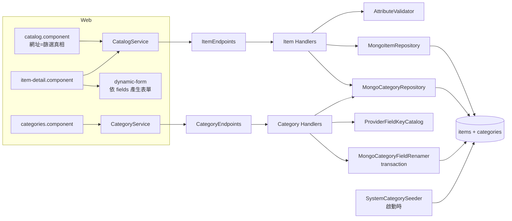
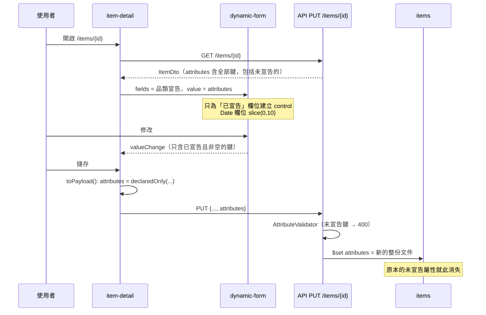

# 模組：Catalog（Categories + Items）

> 階段 2，模組 2。盤點日期 2026-09-26（commit `61b1f5d`）。
> 範圍：`Api/Endpoints/{CategoryEndpoints,ItemEndpoints}.cs`、`Application/Categories/*`（8 檔）、`Application/Items/*`（5 檔）、`Application/Common/{PagedResult,BsonJson,UtcDate}.cs`、`Infrastructure/Mongo/{MongoCategoryRepository,MongoItemRepository,MongoCategoryFieldRenamer,SystemCategoryDefinitions,SystemCategorySeeder,MongoConventions,MongoContext}.cs`、`Domain/Entities/{Category,Item}.cs`；前端 `core/models.ts`、`core/api/{catalog,category}.service.ts`、`core/{catalog-query,catalog-return-point.service}.ts`、`features/{catalog,categories,item-detail}/*.component.ts`、`shared/{dynamic-form,tag-input,item-card}/*.ts`；ADR `0006`、`0010`、`0012`。
> 以下路徑省略 `src/MyCollection.` 前綴；前端路徑省略 `web/src/app/`。

## 職責

1. **品類（Category）＝ schema**：`fields[]` 同時驅動 Angular 動態表單、後端 attributes 驗證、篩選器 UI 與卡片欄位。系統內建 6 個品類（`OwnerId = null`，唯讀，每次啟動都依程式碼定義重新寫入），使用者可以自訂品類。
   證據：`Domain/Entities/Category.cs`；`Infrastructure/Mongo/SystemCategoryDefinitions.cs`；`SystemCategorySeeder.SeedAsync`（`IsUpsert = true`，每次覆寫 `Fields`）；ADR-0012 背景段
2. **欄位鍵是身分**：建立後不可直接修改，只能透過明確的改名命令處理（transaction 內同時搬移品項的值）；來源欄位（Steam／IGDB／PSN、`platform`）不可改名，也不可撤回宣告。
   證據：`Application/Categories/RenameCategoryFieldCommand.cs`；`Infrastructure/Mongo/MongoCategoryFieldRenamer.cs`；`Infrastructure/Providers/ProviderFieldKeyCatalog.cs`；ADR-0012 §一、§二、§四
3. **品項（Item）CRUD**：共用欄位（名稱、描述、標籤、精選、購入資訊、展示模式、評分、存放位置）加上依品類 schema 驗證的 `attributes`。
   證據：`Application/Items/ItemCommands.cs`；`Application/Items/AttributeValidator.cs`
4. **查詢**：全文搜尋、品類、標籤、精選、可搜尋屬性的精確比對、「未設定」篩選（ADR-0006），分頁排序為 `updatedAt desc, _id desc`。
   證據：`Application/Items/ItemQueries.cs` → `SearchItemsQueryHandler`、`DeclaringCategoryIds`；`MongoItemRepository.SearchAsync`
5. **前端列表狀態**：篩選條件以網址為唯一真實來源，返回點（頁數與錨點）存在 `sessionStorage`（ADR-0010）。
   證據：`core/catalog-query.ts`；`core/catalog-return-point.service.ts`

## 對外介面

| Endpoint | 說明 | 證據 |
|---|---|---|
| `GET /categories` | 自己的品類加上系統品類，依名稱排序 | `ListCategoriesQueryHandler`；`MongoCategoryRepository.ListAsync`（`VisibleFilter`） |
| `POST /categories`、`PUT /categories/{id}` | PUT 的語意是**置換整組宣告**：沒帶到的既有鍵視為撤回；撤回受保護的鍵回 400 | `CreateCategoryCommandHandler`、`UpdateCategoryCommandHandler`；ADR-0012 §二 |
| `DELETE /categories/{id}` | 系統品類回 403；仍有品項回 409 並附品項數 | `DeleteCategoryCommandHandler`；ADR-0012 §五 |
| `GET /categories/{id}/missing-fields?provider`、`POST /categories/{id}/ensure-fields` | 讓自訂品類補上 provider 要求的欄位（只追加缺少的） | `ProviderFieldsCommands.cs` |
| `POST /categories/{id}/fields/{key}/rename` | 回傳 `{ category, movedItemCount }` | `RenameCategoryFieldCommandHandler` |
| `GET /items` | 參數：`search`、`categoryId`、`tags`（可重複）、`isShowcased`、`page`、`pageSize`（1–200）、`attr.{key}={value}`、`missingAttrs`（可重複） | `ItemEndpoints`；`SearchItemsQueryValidator` |
| `GET /items/tags`、`GET /items/platforms?categoryId` | 相異值清單 | `ListTagsQueryHandler`、`ListPlatformsQueryHandler` |
| `GET / PUT / DELETE /items/{id}`、`POST /items` | 見下方「寫入規則」 | `ItemCommands.cs`、`GetItemQueryHandler` |

### 寫入規則（`ItemWriteHelper`、`AttributeValidator`）

- `attributes` 必須是 JSON object。**未宣告的鍵直接拒絕（400）**；必填、型別（Text／Number／Bool／Date 限 ISO-8601／Url 限 http(s)／Select 值須在選項內）都會檢查，而且會一次回報全部錯誤。
- `Source`、`ExternalRef`、`Images`、`CreatedAt`、`OwnerId` 不接受使用者輸入。
- Digital 品類的 `LocationId` 一律為 null。
- 日期若沒有時區資訊，視為 UTC（`UtcDate.Normalise`）；資料層的 `UtcOnlyDateTimeSerializer` 遇到非 UTC 值會直接拋錯。
- JSON 與 BSON 的轉換由 `BsonJson` 雙向手寫，避免 driver 輸出 Extended JSON（`$date`）。

## 內部結構

### DI 與持久化慣例
- `MongoContext` 是 Singleton（內含 `MongoClient`，建構時確保 `MongoConventions.Register()` 已執行），repository 是 Scoped。證據：`Infrastructure/DependencyInjection.cs`；`MongoContext` 建構子
- 全域 BSON 慣例：camelCase、`IgnoreExtraElements`、enum 以字串儲存、decimal 以 Decimal128 儲存、只接受 UTC 的 DateTime。證據：`MongoConventions.Register`
- 因為開了 `IgnoreExtraElements`，更新一律用 `$set` 列出具名欄位，不用 `ReplaceOne`，避免文件上的未知欄位被靜默刪除。證據：`MongoItemRepository.UpdateAsync`、`MongoCategoryRepository.UpdateAsync` 的註解

## 資料存取

| 資料 | 儲存 | 讀/寫 | 交易邊界 | 證據 |
|---|---|---|---|---|
| `categories` | MongoDB | 讀寫 | 單文件 `$set`；**沒有樂觀並發控制** | `MongoCategoryRepository` |
| `items` | MongoDB | 讀寫 | 單文件 `$set`，**但 `attributes`、`images`、`tags` 是整個子文件或陣列一起覆寫**；沒有樂觀並發控制 | `MongoItemRepository.UpdateAsync` |
| 欄位改名 | MongoDB | 寫 | **全案唯一的多文件 transaction**：衝突計數 → `$rename`（UpdateMany）→ `arrayFilters` 改 schema 鍵；需要 replica set（dev 與 prod 皆為 Atlas） | `MongoCategoryFieldRenamer.RenameAsync`；ADR-0012 §六 (c)(d) |
| 刪除品類 | MongoDB | 讀→寫 | 先 `CountByCategoryAsync`，再 `DeleteOne`；**兩步之間不是原子操作** | `DeleteCategoryCommandHandler` |
| 系統品類 | MongoDB | 寫 | 啟動時 bulk upsert | `SystemCategorySeeder` |
| 索引 | MongoDB | — | `ix_items_category`、`ix_items_tags`、`ix_items_showcase`、`tx_items_text`（name + description，**沒有指定語言**） | `MongoIndexInitializer` |

## 關鍵流程

### 編輯品項並儲存

證據：`features/item-detail/item-detail.component.ts` → `hydrate`、`toPayload`、`declaredOnly`；`shared/dynamic-form/dynamic-form.component.ts` → `attributes()`、`toControlValue`；`MongoItemRepository.UpdateAsync`（`.Set(x => x.Attributes, item.Attributes)`）。

### 欄位改名
`categories.component` 按下「重新命名」→ `POST .../fields/{key}/rename` → handler 檢查：系統品類 403、欄位不存在 404、受保護鍵 400、新鍵已宣告 400 → `MongoCategoryFieldRenamer` 在 transaction 內執行：同一品項同時有新舊鍵時回 409，否則 `$rename` 並改 schema → 回傳 `movedItemCount`。前端在改名期間用 `busy` 鎖住儲存，避免 PUT 帶著舊鍵送出而被當成撤回。
證據：`RenameCategoryFieldCommandHandler.Handle`；`MongoCategoryFieldRenamer.RenameAsync`；`categories.component.ts` → `confirmRename`、`busy` 的註解。

## 風險與觀察

| # | 項目 | 嚴重度 | 證據 | 說明 |
|---|---|---|---|---|
| C1 | **編輯任何品項都會靜默刪除它的未宣告屬性，違反 ADR-0012 §三** | 高 | ADR-0012 §三（「撤回宣告，品項上的值原封不動留著；重新宣告同一個鍵，值就回來」）；`AttributeValidator.Validate`（未宣告鍵 → 400）；`item-detail.component.ts` → `toPayload`（`attributes: this.declaredOnly(...)`）；`MongoItemRepository.UpdateAsync`（整份 `Set(x => x.Attributes, ...)`） | ADR 只保證**撤回的那一刻**不刪值，但沒有任何路徑能在**之後的編輯**中保留這些值：後端拒收未宣告鍵，前端只好濾掉，然後整份覆寫。實際情境：撤回欄位 X → 之後隨手改了某筆品項的標籤 → 那筆品項的 X 永久消失 → 重新宣告 X 時，只有「沒被編輯過」的品項回得來。使用者不會收到任何提示。建議方向：寫入時改為逐鍵合併（只 `$set`／`$unset` 表單管轄的已宣告鍵），或讓 PUT 保留請求中沒提到的未宣告鍵 |
| C2 | **表單儲存會覆寫背景寫入的結果（lost update）** | 中 | `UpdateItemCommandHandler`（沒有版本或 `updatedAt` 比對）；`MongoItemRepository.UpdateAsync`（`name`、`description`、`attributes`、`images` 整份覆寫）；`item-detail.component.ts` → `refetchFromSteam`（提示使用者「完成後重新整理」，但沒有阻擋儲存） | 使用者觸發 Steam 補完（背景執行數十秒到數分鐘）後繼續留在頁面上，若在重新整理前按下儲存，表單裡的舊名稱與舊 attributes 會蓋掉補完結果。同步（`MongoItemSyncWriter`）更新遊玩時數時也一樣。`images` 若在「讀取品項 → 寫回」之間被上傳 API 或 `ShowcaseImageDownloader` 改動，也會被覆寫，而檔案變成孤兒 |
| C3 | Date 屬性在一次編輯後會變型別並失去時間 | 中 | `PsnProvider.ToExternalItem`（`lastUpdated.UtcDateTime`）、`SteamStoreMapper.ToExternalItem`（`[StoreUpdatedAtKey] = fetchedAt`）→ 以 BSON DateTime 寫入；`dynamic-form.component.ts` → `toControlValue`（`initial.slice(0, 10)`）、`coerce`（改成 `T00:00:00Z` 的 ISO 字串）；`BsonJson.ToBsonValue`（字串 → `BsonString`） | 同一個欄位在不同品項間，有的是 BSON DateTime、有的是字串（`AttributeValidator.IsDate` 兩種都接受，所以不會報錯）。只要編輯過一次，時間部分就歸零（例如「最後遊玩時間」只剩日期）。若日後需要依日期排序或做範圍查詢，型別混雜會讓結果不正確 |
| C4 | 全文搜尋對中文名稱幾乎無效【推論】 | 中 | `MongoIndexInitializer`（`tx_items_text` 沒有指定 `default_language`，預設 english）；`MongoItemRepository.SearchAsync`（`Filter.Text`）；品名多為繁體中文（Steam 補完寫入 tchinese，見 `SteamOptions.StoreLanguage`） | MongoDB 的 text index 只按空白與標點斷詞，沒有 CJK 斷詞。連續的中文字會變成一整個 token，所以搜尋「薩爾達」找不到「薩爾達傳說曠野之息」。這需要實測確認。替代方向：regex（前綴或包含）搭配資料量上限，或改用 Atlas Search（Free 方案有數量限制） |
| C5 | 刪除品項時，圖片檔不會一起刪除 | 低 | `DeleteItemCommandHandler`（只呼叫 `items.DeleteAsync`）；`MongoItemRepository.DeleteAsync` | GCS 或本機會累積孤兒檔案（每張圖有 full、card、thumb 三個檔）。API 已無法存取它們（`ContainsPath` 檢查會失敗），但會持續佔用空間；這也與「刪除」在隱私上的預期不符 |
| C6 | 修改既有欄位的型別或必填設定時，不會遷移或檢查既有值 | 低 | `UpdateCategoryCommandHandler`（只檢查受保護鍵）；`categories.component.ts`（既有欄位的 key 是唯讀，但型別與必填仍可修改）；ADR-0012 §二（「型別變更…尚未定義」） | 改完之後，舊值不符合新型別或缺少必填的品項，在下一次儲存時會收到 400。前端 `coerce('Date')` 遇到無法解析的舊字串時，`toISOString()` 會丟 `RangeError`，儲存按鈕看起來會像沒有反應【推論】 |
| C7 | 同步時依名稱尋找「數位遊戲」品類，而且優先使用使用者自建的同名品類 | 低 | `SyncJobRunner.GetDigitalCategoryAsync`（依 `Name` 比對，`OrderBy(OwnerId is null)`）；`SystemCategoryDefinitions.DigitalGameId`（其實有固定 id） | 使用者只要建立一個同名的自訂品類，同步就會把遊戲寫進去；若該品類沒有宣告 provider 欄位，這些值就是一出生就未宣告的屬性，再遇上 C1 就會消失 |
| C8 | 可搜尋的 Number、Bool、Date 欄位永遠篩不到資料 | 低 | `MongoItemRepository.SearchAsync`（`Filter.Eq($"attributes.{key}", value)`，`value` 是字串）；`categories.component.ts`（任何型別都能勾選「可搜尋」） | 以字串去比對數字或布林值不會相等。系統品類沒有這種組合，但自訂品類可以設定出來 |
| C9 | 前後端 DTO 型別漂移 | 低 | `core/models.ts` → `ItemDto.source: 'Manual' \| 'Steam' \| 'OpenGraph'`；`Domain/Entities/Item.cs` → `ItemSource` 另外有 `Psn` | TypeScript 型別會低報實際可能的值；目前沒有程式依 `source` 分支，影響只在可讀性 |
| C10 | 刪除品類的「計數 → 刪除」與「PUT 品類 → 改名」都沒有並發保護 | 低 | `DeleteCategoryCommandHandler`；`MongoCategoryRepository.UpdateAsync`（沒有版本比對） | 單一使用者且前端有 `busy` 鎖，實際機率很低。若兩個分頁同時操作，可能產生指向已刪除品類的品項，或以舊鍵覆寫已改名的 schema |
| C11 | 搜尋框每按一次鍵就發一次查詢 | 低 | `catalog.component.ts` → `applySearch`（`ngModelChange` 直接導覽，沒有 debounce）；`fetch` 用 `latestRequest` 保證只顯示最後一次的結果 | 結果正確，但每個字元都會觸發一次 `CountDocuments` 加一次 `$text` 查詢；在 Atlas Free 上會消耗操作配額 |

### 做得好的地方
- 授權落在 repository 層：`OwnerFilter` 與 `VisibleFilter` 是所有查詢的起點
- 以 `$set` 取代 `ReplaceOne`，理由寫在註解裡（`IgnoreExtraElements` 會吃掉未知欄位）
- 改名放在 transaction 內，衝突規則與「撤回不刪值」的精神一致（ADR-0012 §三），而且回報搬移筆數
- 受保護鍵來自靜態目錄，不隨 provider 是否註冊而變（ADR-0012 §四）
- 只接受 UTC 的 serializer 讓時區錯誤在寫入當下就爆出來；`UtcDate.Normalise` 在 API 邊界把輸入正規化
- 分頁使用決定性的全序排序鍵（`updatedAt`、`_id`），註解說明為什麼需要
- 前端以網址作為篩選的唯一真相，並處理非同步載入時「還不知道」與「沒宣告」的差別（`pruneUnavailableFilters` 的註解）

## 待確認問題
（已同步到 `99-open-questions.md` 的 Q18–Q20）
- C1：【已回覆 2026-09-26】採用後端逐欄位合併寫入。建議同時補一份 ADR 或在 ADR-0012 §三 補充寫入面的規則。
- C4：中文搜尋是否實際遇過搜不到的情況？可以先用一筆資料實測確認。
- C5：刪除品項時是否應該同時刪除圖片檔？還是刻意保留，作為誤刪時的復原手段？
