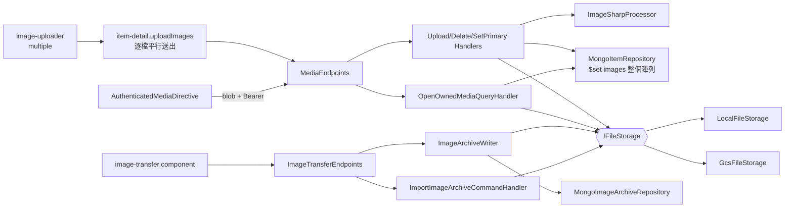
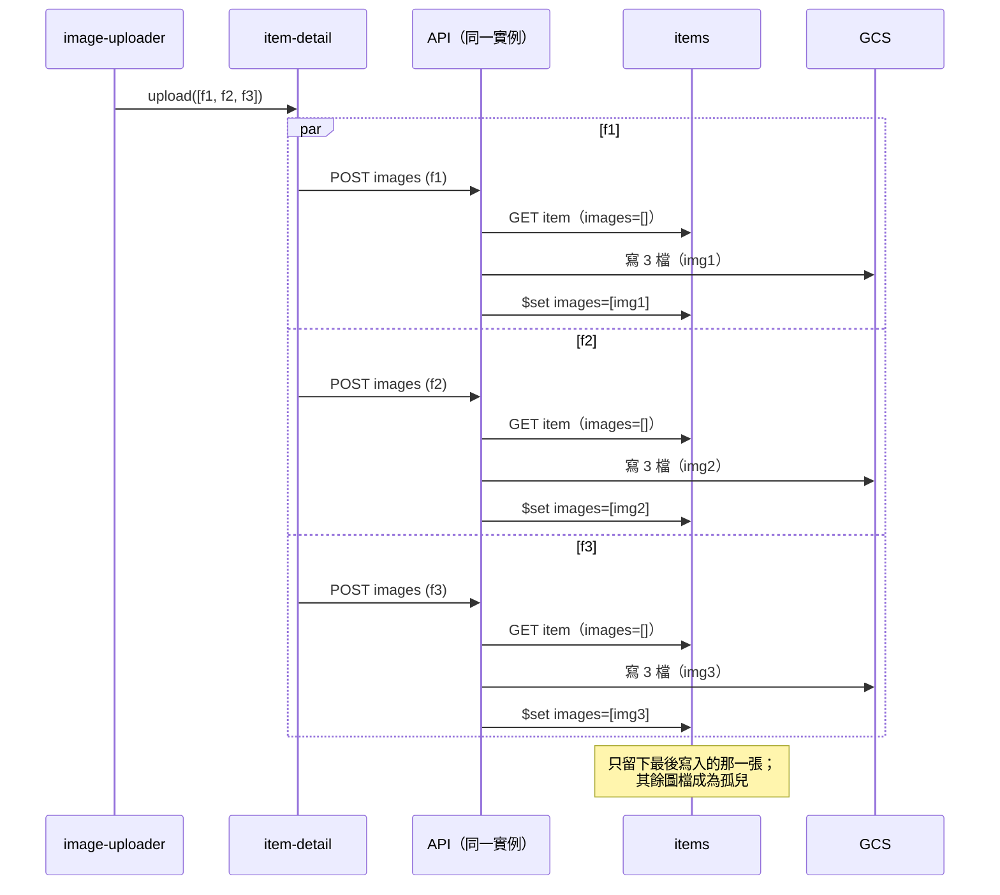

# 模組：Media & Transfer

> 階段 2，模組 3。盤點日期 2026-09-26（commit `61b1f5d`）。
> 範圍：`Api/Endpoints/{MediaEndpoints,ImageTransferEndpoints}.cs`、`Application/Media/*`（3 檔）、`Application/Transfer/*`（6 檔）、`Application/Common/IFileStorage.cs`、`Infrastructure/Imaging/ImageSharpProcessor.cs`、`Infrastructure/Storage/*`（4 檔）、`Infrastructure/Mongo/MongoImageArchiveRepository.cs`；前端 `shared/{authenticated-media.directive,image-uploader/image-uploader.component}.ts`、`core/api/transfer.service.ts`、`features/settings/image-transfer.component.ts`、`features/item-detail/item-detail.component.ts`（上傳呼叫端）。
> 公開媒體路由 `/public/{slug}/media/**` 已在 `14-module-showcase-sharing.md` 說明，本文不重複。
> 以下路徑省略 `src/MyCollection.` 前綴；前端路徑省略 `web/src/app/`。

## 職責

1. **圖片上傳與處理**：每張上傳圖產生 full（長邊 1600）、card（480）、thumb（160）三種 WebP（品質 82），只縮小不放大，並寫進 `IFileStorage`。
   證據：`Application/Media/ImageCommands.cs` → `UploadItemImageCommandHandler`；`Infrastructure/Imaging/ImageSharpProcessor.cs`
2. **圖片管理**：刪除（同時刪三個檔，主圖被刪時由下一張遞補並重新排序）、設為主圖。
   證據：`DeleteItemImageCommandHandler`、`SetPrimaryImageCommandHandler`
3. **登入後的媒體串流**：`GET /media/{**path}`，路徑必須屬於自己某個品項的圖片，副檔名限 `.webp`。
   證據：`Application/Media/MediaQueries.cs` → `OpenOwnedMediaQueryHandler`
4. **儲存抽象**：`IFileStorage` 有 Local 與 GCS 兩種實作，由 `Storage:Provider` 切換（正式環境為 GCS，ADR-0011 §三）。
   證據：`Infrastructure/DependencyInjection.cs`（`switch (storage.Provider...)`）；`Infrastructure/Storage/*`
5. **圖片封存匯出／匯入**：把自己所有圖檔打包成 zip（串流輸出，manifest 放最後），或把 zip 寫回 storage（不動 DB）。原本的用途是在「多台機器共用同一個 Atlas、但各自使用本機儲存」時搬移圖片。
   證據：`Application/Transfer/ImageArchiveWriter.cs`、`ImportImageArchiveCommand.cs` 的類別註解；`features/settings/image-transfer.component.ts` 的說明文字

## 對外介面

| Endpoint | 授權 | 說明 | 證據 |
|---|---|---|---|
| `POST /items/{itemId}/images` | JWT | multipart `file`，端點層檢查 1 byte 到 10 MB；**一次只收一張** | `MediaEndpoints`（`MaxUploadBytes`） |
| `DELETE /items/{itemId}/images/{imageId}` | JWT | 先刪檔案，再更新 DB | `DeleteItemImageCommandHandler` |
| `POST /items/{itemId}/images/{imageId}/primary` | JWT | — | `SetPrimaryImageCommandHandler` |
| `GET /media/{**path}` | JWT | `Cache-Control: private, max-age=300` | `MediaEndpoints`；`OpenOwnedMediaQueryHandler` |
| `GET /images/export` | JWT | 直接寫入 `Response.Body` 串流；開始串流後就無法再改 status code | `ImageTransferEndpoints`；`ExportImageArchiveCommandHandler` |
| `POST /images/import` | JWT | **沒有 request body 上限**（`UnlimitedRequestBody`），先落地成暫存檔再開 zip | `ImageTransferEndpoints` |

前端顯示私有圖片時，一律透過 `AuthenticatedMediaDirective` 以 HttpClient 取得 blob（這樣 interceptor 才會附上 Bearer），再轉成 object URL；外部 URL 與公開分享 URL 則直接交給瀏覽器，避免把 token 送到第三方。證據：`shared/authenticated-media.directive.ts`（類別註解、`load`、`clear` 會 revoke）。

## 內部結構

### 路徑與邊界檢查

- 物件路徑格式：`{ownerId}/{itemId}/{imageId}-{full|card|thumb}.webp`。證據：`ImageCommands.cs` → `MediaPaths`
- `StoragePath.Validate` 拒絕以下情況：空字串、開頭是 `/`、含 `\0`、`\`、`:`，或任一路徑區段是空白、`.`、`..`。`LocalFileStorage.Resolve` 另外檢查解析後的完整路徑仍在 root 之內。證據：`Infrastructure/Storage/StoragePath.cs`；`LocalFileStorage.Resolve`
- 匯入時的 entry 檢查：manifest 的 ownerId 必須等於登入者；每個 entry 必須以 `{ownerId}/` 開頭、以 `.webp` 結尾、不含 `..`；**任一 entry 不合格就整包拒絕**；已存在的路徑直接略過，不覆蓋。manifest 大小上限 1 MB。證據：`ImportImageArchiveCommandHandler.CollectImageEntries`、`ReadManifest`

### DI lifetime
`IFileStorage` 與 `IImageProcessor` 是 Singleton（無狀態）；`StorageClient` 也是 Singleton（`StorageClient.Create()`）；`ImageArchiveWriter` 與 `IImageArchiveRepository` 是 Scoped（依賴 `IUserContext`）。都合理。證據：`Infrastructure/DependencyInjection.cs`。

## 資料存取

| 資料 | 儲存 | 讀/寫 | 交易邊界 | 證據 |
|---|---|---|---|---|
| 圖檔（三種尺寸） | GCS（正式）／本機 | 寫、讀、刪 | 沒有交易；**上傳是先寫三個檔再更新 DB，刪除是先刪檔再更新 DB** | `UploadItemImageCommandHandler`、`DeleteItemImageCommandHandler` |
| `items.images` | MongoDB | 讀→改→寫 | 在記憶體裡修改整個陣列，再用 `$set images` 整份寫回，**沒有並發控制** | `MongoItemRepository.UpdateAsync`（`.Set(x => x.Images, item.Images)`） |
| 匯出清單 | MongoDB | 讀 | owner filter 加上 `images` 陣列長度 > 0，依 `_id` 排序，一次全部載入 | `MongoImageArchiveRepository` |
| 匯入 | GCS／本機 | 寫 | 不碰 DB；逐檔「檢查是否存在 → 寫入」 | `ImportImageArchiveCommandHandler.Handle` |
| GCS 讀取 | GCS | 讀 | `OpenReadAsync` 會把整個物件下載進 `MemoryStream` 後才回傳 | `GcsFileStorage.OpenReadAsync` |

## 關鍵流程

### 一次選多張圖上傳

證據：`features/item-detail/item-detail.component.ts` → `uploadImages`（`for (const file of files) this.catalog.uploadImage(...).subscribe(...)`，沒有串接等待）；`shared/image-uploader/image-uploader.component.ts`（`<input type="file" multiple>`）；`UploadItemImageCommandHandler.Handle`（`item.Images.Add` 後呼叫 `items.UpdateAsync`）；`MongoItemRepository.UpdateAsync`。

【推論】實際會掉幾張，取決於各請求「讀取 → 寫回」的時間是否重疊。ImageSharp 處理一張圖需要數百毫秒，因此在多選上傳時重疊的機率很高。

### 匯出
`GET /images/export` → 撈出全部有圖的品項 → 每張圖的三個檔依序從 storage 讀出，寫進 zip entry → 每個 entry 寫完就把緩衝送出（`SyncSafeBufferedStream`，繞過 `ZipArchiveEntry` 同步 Dispose 的 runtime 問題）→ 最後寫 manifest（包含檔案數與遺失清單）與中央目錄。前端以 `responseType: 'blob'` 把整個檔案收進記憶體，再觸發下載。
證據：`ImageArchiveWriter.WriteAsync` 及其註解（dotnet/runtime#107171）；`core/api/transfer.service.ts`；`image-transfer.component.ts` → `download`。

## 風險與觀察

| # | 項目 | 嚴重度 | 證據 | 說明 |
|---|---|---|---|---|
| M1 | **多選上傳會遺失圖片，留下孤兒檔** | 高 | 見上方「一次選多張圖上傳」的證據 | 這是日常操作路徑（上傳元件預設就允許多選）。每張圖的請求都讀取同一份舊的 `images` 陣列，再整份覆寫，最後只保留一張，其餘圖檔的檔案留在 GCS 上沒有任何引用。沒有錯誤訊息；每個請求都回 201，前端各自 `reloadItem`，最後畫面上只看得到部分圖片。與 `12-module-catalog.md` C2 同源（`images` 整份覆寫，沒有並發控制）；Q18 決定的「逐欄位合併寫入」應一併涵蓋 `images`：上傳改用 `$push`，刪除改用 `$pull` |
| M2 | **上傳的原始 metadata（EXIF，含 GPS）可能原樣保留在輸出的 WebP 中**【推論】 | 高（若屬實） | `ImageSharpProcessor.ProcessAsync`、`ResizeAsync`（`source.Clone(...)` 後直接 `SaveAsync`，沒有清除 `Metadata.ExifProfile`／`XmpProfile`）；全 repo 搜尋 `ExifProfile`／`Metadata` 沒有結果 | ImageSharp 的 clone 會帶著 metadata，WebP encoder 會寫出 EXIF／XMP chunk【推論】。用手機拍攝的收藏品照片通常帶有 GPS 座標；full 尺寸圖可以經由公開分享路徑匿名讀取（`14-module-showcase-sharing.md` S8）。這會直接繞過 ADR-0008「存放位置永不公開」的設計意圖：照片本身就洩漏了地點。需要實測：上傳一張帶 GPS 的 JPG，再用 exiftool 檢查輸出的 `-full.webp` |
| M3 | 圖片解碼沒有像素上限，可能造成解壓縮炸彈 OOM | 中 | `ImageSharpProcessor.ProcessAsync`（`Image.LoadAsync(source, ct)` 沒有傳入 `DecoderOptions`，也沒有設定 `MemoryAllocator` 上限）；`infra/terraform/runtime/services.tf`（API 記憶體 `512Mi`，`max_instance_count = 1`） | 一張 10 MB 以內的 PNG 可以宣告極大的寬高，解碼後需要的記憶體遠超過 512 MiB。ImageSharp 3.x 的預設配置上限高於此值【推論】，因此可能讓唯一的 API 實例被 OOM 砍掉。`ShowcaseImageDownloader` 也使用同一個 processor（`14-module-showcase-sharing.md` S4）。目前只有你自己使用，所以是中；改為邀請制後需要優先處理 |
| M4 | 匯出受限於 Cloud Run 請求逾時，失敗時產生看起來正常的殘缺 zip | 中 | `ImageTransferEndpoints`（註解：「串流開始後就無法再改 status code，中途失敗只能斷線」）；`services.tf`（`timeout = "300s"`）；`GcsFileStorage.OpenReadAsync`（逐檔完整下載） | 圖片數量大時，300 秒內送不完就會被砍斷。前端以 blob 接收，瀏覽器可能拿到被截斷的檔案（沒有中央目錄，無法解開）。manifest 寫在最後，所以殘缺檔案連 manifest 都沒有 |
| M5 | 匯入端點在正式環境幾乎不可用，而且沒有防護 | 中 | `ImageTransferEndpoints`（`UnlimitedRequestBody`、`Path.GetTempFileName()`）；Cloud Run 對 HTTP/1 請求有 32 MiB 上限【推論，依 Cloud Run 公開限制】，而且 `/tmp` 是記憶體檔案系統，會吃掉容器的 512 MiB；`ImportImageArchiveCommandHandler`（沒有檢查 entry 數量或解壓後大小，也沒有驗證內容是否為圖片） | (a) 這個功能的前提是「各機器使用本機儲存」，正式環境改用 GCS 後，實際需求已經不存在（ADR-0011 §三）。(b) 端點仍然對外開放：放寬上限的 body 會先寫進記憶體型的 `/tmp`；zip bomb 可以在自己的前綴下寫入任意大小、任意內容的 `.webp` 檔（DB 沒有引用，所以無法被讀取，但會佔用儲存空間）。建議方向：正式環境停用此端點，或限制大小與 entry 數量 |
| M6 | 上傳與刪除的「檔案 ↔ DB」順序會在失敗時留下不一致 | 低 | `UploadItemImageCommandHandler`（先寫三個檔，再 `UpdateAsync`；更新失敗或品項已被刪除時，檔案成為孤兒）；`DeleteItemImageCommandHandler`（先刪檔，再 `UpdateAsync`；更新失敗時，DB 仍指向已不存在的檔案，顯示為破圖） | 單一使用者、低頻操作，影響有限。刪除的順序可以反過來（先更新 DB，再盡力刪檔），這樣失敗時只會留下孤兒檔，不會出現破圖 |
| M7 | `IFileStorage.DeleteDirectoryAsync` 已經實作，但沒有任何呼叫端 | 低 | `IFileStorage.cs`（註解說明它是為了清除孤兒檔而設計）；全 repo 搜尋只找到介面與兩個實作 | 這正好是 `12-module-catalog.md` C5（刪除品項不刪圖檔）與 M1 孤兒檔的解法，但還沒接上 |
| M8 | 前端把整份匯出檔收進記憶體 | 低 | `transfer.service.ts`（`responseType: 'blob'`） | 收藏量大時，瀏覽器分頁會佔用與 zip 同等大小的記憶體；改用瀏覽器原生下載（`<a href>` 加上帶 token 的一次性 URL）才能真正串流，但這需要另外設計授權方式 |
| M9 | 上傳元件的 `busy` 狀態從未被設為 true | 低 | `image-uploader.component.ts`（`busy = signal(false)`，沒有任何地方呼叫 `set(true)`） | 上傳中的文字永遠不會顯示；使用者可能在上傳完成前重複操作，加劇 M1 |

### 做得好的地方
- 匯入採用「整包驗證後才寫入」，並檢查 owner 前綴，註解明確說明為什麼 `IFileStorage` 的根目錄檢查還不夠：`CollectImageEntries`
- 本機儲存有雙重邊界檢查（字串規則加上解析後的絕對路徑）：`StoragePath.Validate`、`LocalFileStorage.Resolve`
- 匯出是真正的串流，並記錄了 runtime 的限制與繞過方式：`ImageArchiveWriter` 的 `SyncSafeBufferedStream` 註解
- manifest 的版本號從 2 開始，避免舊格式誤通過檢查：`ImageArchiveManifest.CurrentSchemaVersion` 的註解
- 私有圖片不把 token 送給第三方網址；object URL 會被 revoke；effect 只追蹤 source，避免無限重打：`AuthenticatedMediaDirective`
- 輸出一律是 WebP，路徑也限定 `.webp`，讀取端不必處理多種 content type：`OpenOwnedMediaQueryHandler.OpenAsync`

## 待確認問題
（已同步到 `99-open-questions.md` 的 Q21–Q22）
- M2：是否可以實測一張帶 GPS 的手機照片？若屬實，建議列為最優先修正項目。
- M5：正式環境還需要圖片匯出／匯入嗎？若不需要，是否直接在正式環境停用這兩個端點？
  - 【已回覆 2026-09-26（Q22）】不需要。M4／M5 的建議方向改為「正式環境停用或移除匯出／匯入端點」，列入技術債。
