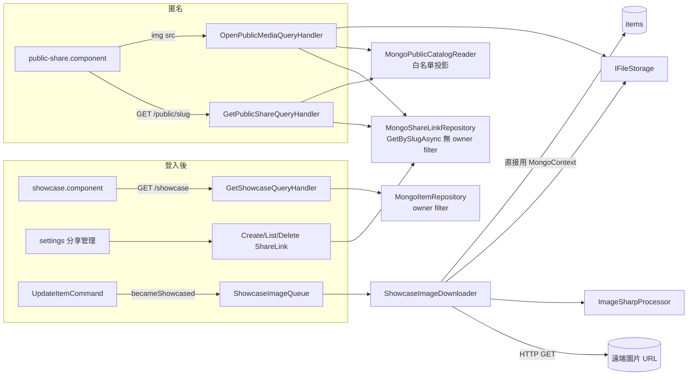
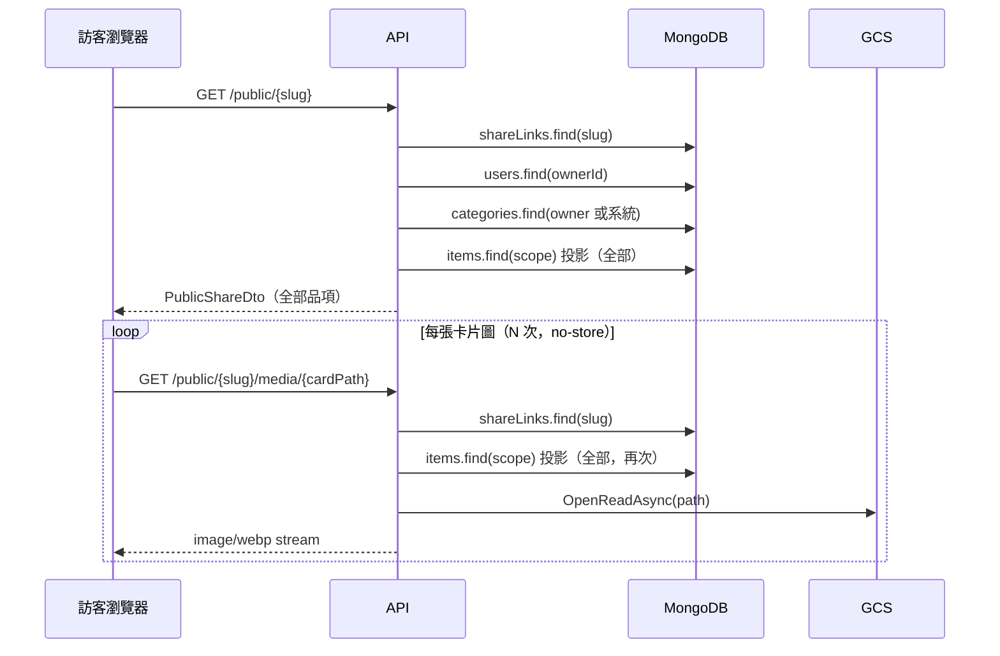

# 模組：Showcase & Sharing

> 階段 2，模組 4。盤點日期 2026-09-26（commit `61b1f5d`）。
> 範圍：`Api/Endpoints/{ShowcaseEndpoints,ShareEndpoints}.cs`、`Api/Endpoints/MediaEndpoints.cs`（公開媒體路由）、`Application/Showcase/*`、`Application/Sharing/*`、`Application/Media/MediaQueries.cs`、`Infrastructure/Imaging/{ShowcaseImageQueue,ShowcaseImageDownloader}.cs`、`Infrastructure/Mongo/{MongoShareLinkRepository,MongoPublicCatalogReader}.cs`、`Domain/Entities/ShareLink.cs`；前端 `web/src/app/core/api/share.service.ts`、`features/public/public-share.component.ts`、`features/showcase/showcase.component.ts`、`shared/showcase-sections/showcase-display-item.ts`；ADR `0007`、`0008`、`0009`、`0011`。
> 以下路徑省略 `src/MyCollection.` 前綴。

## 職責

1. **精選牆（登入後）**：跨品類列出 `isShowcased = true` 的品項，依展示模式（List／Hero／Stats）分頁籤呈現；Collage 頁籤刻意不依展示模式篩選。
   證據：`Application/Showcase/GetShowcaseQuery.cs` → `GetShowcaseQueryHandler`；`docs/adr/0007-*.md`、`0009-*.md`
2. **分享連結管理**：建立（範圍為 Showcase 或 Category，可選擇公開價格與評分、設定到期日）、列出、刪除。
   證據：`Application/Sharing/ShareCommands.cs`
3. **匿名公開分享頁**：以 slug 讀取白名單投影，**不經過 `IUserContext`**。
   證據：`Application/Sharing/GetPublicShareQuery.cs`（類別註解）、`Infrastructure/Mongo/MongoPublicCatalogReader.cs`
4. **公開圖片串流**：只有在有效分享範圍內的圖片才可匿名讀取。
   證據：`Application/Media/MediaQueries.cs` → `OpenPublicMediaQueryHandler`
5. **精選圖片延遲下載**：品項第一次被設為精選且沒有本地圖片時，在背景把 provider 的遠端圖片抓回儲存。
   證據：`Application/Items/ItemCommands.cs`（`becameShowcased && existing.Images.Count == 0` → `showcaseImageQueue.Enqueue`）；`Infrastructure/Imaging/ShowcaseImageDownloader.cs`

## 對外介面

| Endpoint / 入口 | 授權 | 說明 | 證據 |
|---|---|---|---|
| `GET /showcase?page&pageSize` | JWT | pageSize 1–200，預設 24 | `ShowcaseEndpoints`；`GetShowcaseQueryValidator` |
| `GET /shares` | JWT | 自己的連結，依建立時間由新到舊 | `ShareEndpoints`；`MongoShareLinkRepository.ListAsync` |
| `POST /shares` | JWT | 回 `201 Created`，Location 為 `/public/{slug}` | `ShareEndpoints`；`CreateShareLinkCommandHandler` |
| `DELETE /shares/{id}` | JWT | 非法 id 或不屬於自己的連結都回 404 | `DeleteShareLinkCommandHandler`；`MongoShareLinkRepository.DeleteAsync` |
| `GET /public/{slug}` | **匿名** | 回傳 `PublicShareDto`，**不分頁**，一次回傳範圍內全部品項 | `ShareEndpoints`；`GetPublicShareQueryHandler` |
| `GET /public/{slug}/media/{**path}` | **匿名** | 限 `.webp`；`Cache-Control: no-store` | `MediaEndpoints`；`OpenPublicMediaQueryHandler`、`OpenOwnedMediaQueryHandler.OpenAsync` |
| `ShowcaseImageDownloader`（`BackgroundService`） | — | 消費行程內 unbounded channel | `Infrastructure/Imaging/ShowcaseImageDownloader.cs`、`ShowcaseImageQueue.cs` |

### 公開資料的白名單

| 欄位 | 公開與否 | 控制方式 | 證據 |
|---|---|---|---|
| name、description、tags、images、categoryName、displayMode | 永遠公開 | `BaseProjection` | `MongoPublicCatalogReader.BaseProjection` |
| **attributes（整份文件）** | **永遠公開** | `BaseProjection.Include(x => x.Attributes)` | 同上；`GetPublicShareQueryHandler`（`BsonJson.ToDictionary(i.Attributes)`） |
| price、acquiredAt | 選擇性 | `ShareLink.IncludePrice` | `MongoPublicCatalogReader.ListItemsAsync` |
| rating | 選擇性 | `ShareLink.IncludeRating` | 同上；`docs/adr/0008-*.md` |
| storageLocation、acquisition.vendor、locationId | 永不公開 | 不在投影內，也沒有對應旗標 | `IPublicCatalogReader.cs`（`PublicItemProjection` 註解）；ADR-0008 |
| ownerDisplayName | 永遠公開 | 查無使用者時顯示 `"Collector"` | `GetPublicShareQueryHandler` |

`PublicItemDto` 刻意不共用內部的 `ItemDto`，避免內部 DTO 新增欄位時意外外流。證據：`Application/Sharing/ShareDtos.cs`（註解）。

## 內部結構

### 授權邊界

- 匿名路徑刻意不注入 `IUserContext`，也不使用 `IItemRepository`；owner 由 `ShareLink.OwnerId` 明確傳入 `IPublicCatalogReader`。證據：`GetPublicShareQueryHandler` 的類別註解；`IPublicCatalogReader.ListItemsAsync` 的參數註解
- `IShareLinkRepository.GetBySlugAsync` 刻意不套 owner filter，其餘方法都套。證據：`Application/Sharing/IShareLinkRepository.cs`；`MongoShareLinkRepository`
- 過期連結回 404，不透露連結曾經存在。證據：`GetPublicShareQueryHandler`（註解「過期連結對外表現得像不存在」）；`OpenPublicMediaQueryHandler` 採用相同判斷
- 公開媒體採雙重檢查：路徑必須屬於分享範圍內某個品項的 `Path`／`CardPath`／`ThumbPath`，副檔名也必須是 `.webp`。證據：`OpenOwnedMediaQueryHandler.ContainsPath`、`OpenAsync`
- slug 由 `RandomNumberGenerator.GetString` 從 55 個字元中取 12 個，約 69 bits 熵，並有唯一索引 `ux_shareLinks_slug`。證據：`CreateShareLinkCommandHandler.GenerateSlug`；`MongoIndexInitializer`

## 資料存取

| 資料 | 儲存 | 讀/寫 | 交易邊界 | 證據 |
|---|---|---|---|---|
| `shareLinks` | MongoDB | 讀寫 | 單文件；slug 撞號時轉為 `ConflictException`（409） | `MongoShareLinkRepository.InsertAsync` |
| `items`（精選牆） | MongoDB | 讀 | `IItemRepository.SearchAsync` 使用 `ItemQuerySpec { IsShowcased = true }`，套 owner filter | `GetShowcaseQueryHandler` |
| `items`（公開） | MongoDB | 讀 | 投影查詢，依 `updatedAt desc, _id desc` 排序，**不分頁、沒有上限** | `MongoPublicCatalogReader.ListItemsAsync` |
| `categories`（公開） | MongoDB | 讀 | 自己的分類加上系統分類（`OwnerId` 為 null） | `MongoPublicCatalogReader.ListCategoriesAsync` |
| `items.images`（下載後） | MongoDB | 寫 | 條件式 `UpdateOne`：`_id` 且 `images` 陣列長度為 0，才 `$push`，避免覆蓋使用者在下載期間上傳的圖片 | `ShowcaseImageDownloader.DownloadAsync` |
| 圖片檔 | GCS 或本機 | 寫 | 先寫三個檔（full／card／thumb），再更新 DB；兩者之間沒有交易 | `ShowcaseImageDownloader.SaveAsync` |
| 下載佇列 | 行程記憶體 | 讀寫 | unbounded `Channel<ObjectId>`，`TryWrite` 不會失敗 | `ShowcaseImageQueue` |

## 關鍵流程

### 匿名瀏覽分享頁（List 頁籤，N 張圖）

證據：`GetPublicShareQueryHandler.Handle`；`OpenPublicMediaQueryHandler.Handle`（每次都呼叫 `catalog.ListItemsAsync`）；`MediaEndpoints`（`CacheControl = "no-store"`）；`public-share.component.ts` → `imageUrl`。

### 精選圖片背景下載

`PUT /items/{id}`（`isShowcased` 從 false 改為 true，且沒有本地圖片）→ `ShowcaseImageQueue.Enqueue` → `ShowcaseImageDownloader` 依序嘗試 `headerUrl` → `coverUrl` → `iconUrl` 屬性 → `HttpClient.GetStreamAsync` → 整份讀進 `MemoryStream` → `ImageSharpProcessor.ProcessAsync` → 存三種尺寸 → 條件式 `$push`。失敗只記 warning，不重試。
證據：`Application/Items/ItemCommands.cs`（約第 205–226 行）；`ShowcaseImageDownloader.DownloadAsync`、`ResolveSourceUrl`、`ExecuteAsync`（catch 只記 `LogWarning`）。

## 風險與觀察

> 風險評估前提：Q12 回覆「目前只有自己用，未來改為邀請制」。但**匿名分享頁本來就是對外公開的**，所以 S1、S2 的評估不受使用者規模影響。

| # | 項目 | 嚴重度 | 證據 | 說明 |
|---|---|---|---|---|
| S1 | **每個公開圖片請求都重撈一次整個分享範圍** | 高 | `OpenPublicMediaQueryHandler.Handle`（每張圖都呼叫 `catalog.ListItemsAsync`，而且拿的是含 attributes 與 images 的完整投影）；`MongoPublicCatalogReader.ListItemsAsync`（不分頁、沒有上限）；`MediaEndpoints`（`no-store`）；`infra/terraform/runtime/services.tf`（`max_instance_count = 1`）；ADR-0011（Atlas Free） | 一次公開頁載入等於 1 + N 次「撈整個範圍」的查詢，而且匿名、沒有速率限制、沒有快取。Category 範圍若有數百件品項，一個訪客捲動清單就會產生數百次全量查詢，容易觸及 Atlas Free 的操作限制，或塞滿唯一的 Cloud Run 實例。這是匿名路徑，與使用者規模無關。建議方向：改成以單一品項或圖片路徑直接查詢（owner + scope + `images.cardPath` 條件），並允許短時間的 public cache |
| S2 | **attributes 整份公開，沒有欄位層級的可見性控制** | 高（Q15 確認不符預期） | `MongoPublicCatalogReader.BaseProjection`（`Include(x => x.Attributes)`）；`GetPublicShareQueryHandler`；ADR-0008 只處理 `StorageLocation` 與 `Rating` | 投影名為「白名單」，但 attributes 是使用者自訂的動態欄位，整份都會外流。任何在分類中自訂的欄位（例如序號、備註、購買管道）與 provider 寫入的欄位（遊玩時數、獎盃進度、`externalRef` 以外的 id）都會出現在匿名回應中。這與 ADR-0008 的設計精神（新欄位不會自動外流）不一致 |
| S3 | **精選圖片下載只觸發一次，佇列在記憶體中，失敗不會重試** | 中 | `ShowcaseImageQueue`（行程內 channel）；`ItemCommands.cs`（只有 `becameShowcased` 時才 Enqueue）；`ShowcaseImageDownloader.ExecuteAsync`（catch 後直接丟棄）；`services.tf`（`min_instance_count = 0`、`cpu_idle = true`） | Cloud Run 在回應送出後會節流 CPU，並可能縮到 0，使排隊中的下載延後或遺失。ADR-0011 接受「外部來源衍生圖片允許失敗後重新產生」，但**目前沒有重新產生的入口**：只有把精選取消再勾選一次才會重新排入。結果是精選牆長期依賴遠端 CDN 的熱連結（見 S7） |
| S4 | 背景下載沒有大小上限與內容檢查，URL 來自可編輯的 attributes | 低（邀請制上線後升為中） | `ShowcaseImageDownloader.DownloadAsync`（`GetStreamAsync` → `CopyToAsync(new MemoryStream())`，沒有長度限制；HttpClient 只設 30 秒逾時）；`SystemCategoryDefinitions.cs`（`headerUrl`／`iconUrl`／`coverUrl` 是使用者可編輯的 Url 欄位） | (a) 指向超大檔案會把整份內容讀進記憶體。(b) 任何登入使用者都可以把 `headerUrl` 設成任意位址，讓 API 發出請求（blind SSRF；只有能被 ImageSharp 解碼的內容才會留下）。現在只有你自己使用，所以是低；開放邀請後與 `15-module-ingestion.md` R4 同級 |
| S5 | 可以建立已經過期的分享連結；過期連結不會被清理 | 低 | `CreateShareLinkCommandValidator`（沒有驗證 `ExpiresAt > now`）；沒有 TTL index 或清理作業 | 功能上不會出錯（查詢時就判定過期），只是資料會殘留 |
| S6 | 公開圖片路徑暴露內部 id | 低 | `ShowcaseImageDownloader`（路徑格式 `{ownerId}/{itemId}/{imageId}-*.webp`）；`PublicImageDto` 回傳 `CardPath`／`ThumbPath` | ownerId 是 ObjectId，內含建立時間。匿名訪客可以得知擁有者的內部 id 與帳號建立時間 |
| S7 | 公開頁的訪客瀏覽器會直接載入第三方圖片 URL | 低 | `showcase-display-item.ts` → `coverImageUrl`（沒有本地圖片時改用 attributes 的 `headerUrl`／`coverUrl`／`iconUrl`，只檢查 `startsWith('http')`） | 訪客的 IP 與 Referer 會送到 Steam、IGDB、PSN 的 CDN，或使用者自填的任意網域；這也是 S3 的連帶效應 |
| S8 | 公開媒體允許讀取原尺寸圖（`Path`），但 DTO 只提供 card 與 thumb | 低 | `OpenOwnedMediaQueryHandler.ContainsPath`（三種路徑都接受）；`PublicImageDto`（沒有 `Path`） | 猜得到檔名規則（`-full.webp`）就能取得原圖；ADR-0011 允許範圍內圖片匿名讀取，所以這是刻意設計還是疏漏，需要確認 |
| S9 | 建立 Category 範圍的連結時，不檢查分類是否存在或屬於自己 | 低 | `CreateShareLinkCommandValidator`（只檢查 ObjectId 格式）；`MongoPublicCatalogReader.ListItemsAsync`（有 owner filter） | 不會外洩資料（查詢有 owner filter），但可能建出內容永遠是空的連結 |
| S10 | 精選牆前端會一次抓完全部精選品項 | 低 | `showcase.component.ts` → `fetchPage`（每頁 200 筆，遞迴抓到 `MAX_SHOWCASE_ITEMS`） | 刻意設計（註解引用 ADR-0009，讓頁籤計數保持穩定）；品項變多時第一次載入的時間會線性增加 |

### 做得好的地方
- 公開 DTO 與內部 DTO 分離，投影採 Include 而不是 Exclude：`ShareDtos.cs`、`MongoPublicCatalogReader.BaseProjection`
- 存放位置永不公開，而且刻意不提供開關：ADR-0008
- 過期連結與不存在的連結回應一致，不洩漏連結是否曾存在：`GetPublicShareQueryHandler`
- slug 的熵足夠，並使用 CSPRNG：`GenerateSlug`
- 背景下載使用條件式 `$push`，避免與使用者上傳的圖片競爭：`ShowcaseImageDownloader.DownloadAsync`
- `DeleteShareLinkCommandHandler` 把非法 id 轉成 404，註解說明為什麼不讓它變成 500

## 待確認問題
（已同步到 `99-open-questions.md` 的 Q15–Q17）
- attributes 全部公開是否符合預期？是否需要在分類欄位上加 `IsPublic`，或改成只公開 `ShowOnCard` 的欄位（S2）？
- 公開媒體可讀原尺寸圖（S8）是刻意設計嗎？
- 精選圖片下載失敗後，是否需要重試或手動重新產生的入口（S3）？
