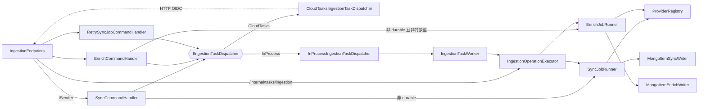
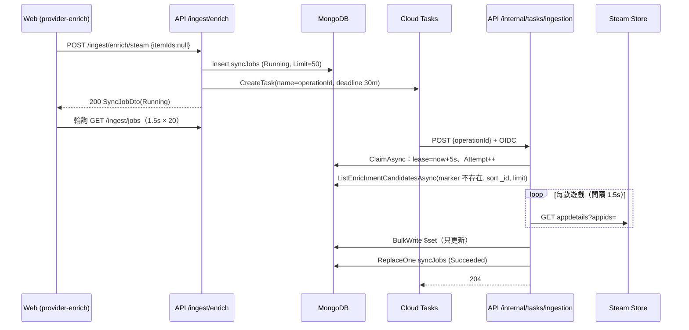
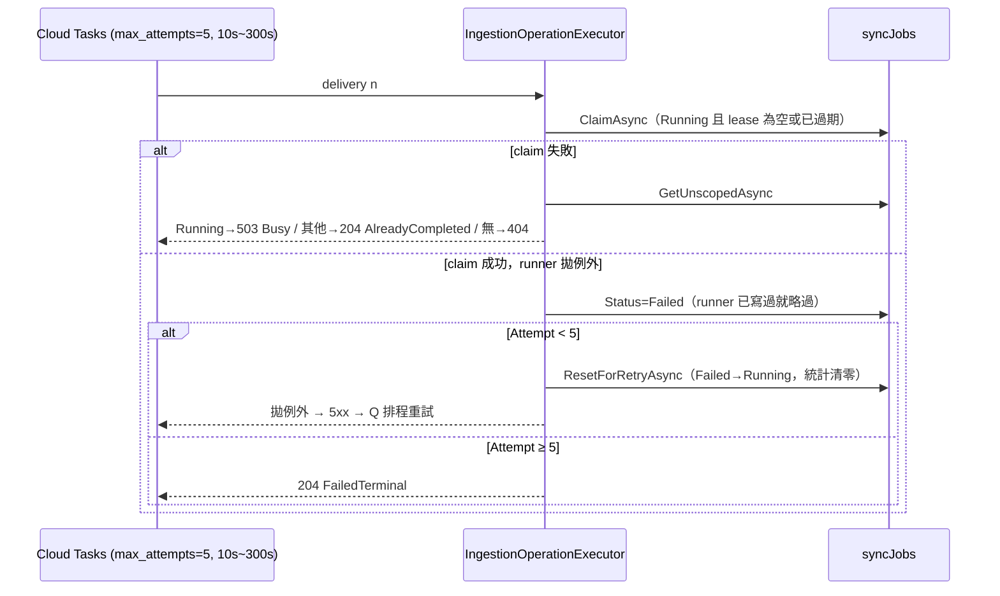

# 模組：Ingestion（同步／補完／外部 Provider）

> 階段 2，模組 5。盤點日期 2026-09-26（commit `61b1f5d`）。
> 範圍：`Api/Endpoints/IngestionEndpoints.cs`、`Application/Ingestion/*`（17 檔）、`Infrastructure/Ingestion/*`（5 檔）、`Infrastructure/Providers/**`（17 檔）、`Infrastructure/Mongo/Mongo{SyncJobRepository,ExternalAccountRepository,ItemSyncWriter,ItemEnrichWriter}.cs`、`Domain/Entities/{SyncJob,ExternalAccount}.cs`。
> 以下路徑省略 `src/MyCollection.` 前綴，例如 `Application/Ingestion/SyncCommand.cs` 即 `src/MyCollection.Application/Ingestion/SyncCommand.cs`。

## 職責

1. **Sync（整庫同步）**：以使用者綁定的外部帳號（Steam API key／PSN NPSSO）拉回整個遊戲庫，bulk upsert 到 `items`，固定歸入系統分類「數位遊戲」。
   證據：`Application/Ingestion/SyncJobRunner.cs` → `SyncJobRunner.RunAsync`、`GetDigitalCategoryAsync`
2. **Enrich（補完既有品項）**：依品項的外部識別碼向 provider 反查，套用欄位擁有權規則後只更新、不建立。
   證據：`Application/Ingestion/EnrichJobRunner.cs` → `EnrichJobRunner.RunAsync`；`Infrastructure/Mongo/MongoItemEnrichWriter.cs` → `BuildModel`（`IsUpsert = false`）
3. **Lookup（表單預填）**：依 URL（OpenGraph）或關鍵字（IGDB）取回 metadata，只回傳 DTO、不寫資料庫。
   證據：`Application/Ingestion/FetchByUrlQuery.cs`、`SearchProviderQuery.cs`
4. **外部帳號管理**：綁定／解除／列出，API key 以 `ISecretProtector` 加密保存，永不回傳前端。
   證據：`Application/Ingestion/ExternalAccountCommands.cs` → `LinkExternalAccountCommandHandler`、`ExternalAccountDto`
5. **作業（SyncJob）生命週期**：建立、派送（InProcess channel 或 Cloud Tasks）、claim／lease、重試、結算。
   證據：`Application/Ingestion/IngestionOperationExecutor.cs`、`Infrastructure/Mongo/MongoSyncJobRepository.cs`

### Provider 能力矩陣

能力不是旗標宣告，而是由實作的介面推導（`Application/Ingestion/ProviderCapabilities.cs` → `ProviderCapabilities.Of`）。

| Provider key | 實作類別 | BulkSync | UrlLookup | Enrich | Search | `PrefersBackgroundExecution` | 註冊條件 |
|---|---|:-:|:-:|:-:|:-:|:-:|---|
| `steam` | `Infrastructure/Providers/SteamProvider.cs` | ✔ | | ✔ | | `true` | 永遠 |
| `psn` | `Infrastructure/Providers/Psn/PsnProvider.cs` | ✔ | | | | — | 永遠 |
| `opengraph` | `Infrastructure/Providers/OpenGraphProvider.cs` | | ✔ | | | — | 永遠 |
| `igdb` | `Infrastructure/Providers/Igdb/IgdbProvider.cs` | | | ✔ | ✔ | `false` | `IgdbOptions.IsConfigured`（ClientId 與 ClientSecret 皆非空） |

證據：`Infrastructure/DependencyInjection.cs` → `AddInfrastructure`（`IMetadataProvider` 多重註冊與 `if (igdb.IsConfigured)`）

## 對外介面

| Endpoint / 入口 | 說明 | 證據 |
|---|---|---|
| `GET /ingest/providers` | 列出已註冊 provider 與能力字串 | `Api/Endpoints/IngestionEndpoints.cs` → `MapIngestionEndpoints` |
| `POST /ingest/sync/{provider}` | 建立 Sync 作業，回 `202 Accepted` + `SyncJobDto` | 同上 → `SyncCommand` |
| `POST /ingest/enrich/{provider}` | body `{ itemIds?, limit? }`；無 itemIds（或空陣列）即批次補完，`limit` 預設 50、夾在 1–200；回 `200 OK` | 同上 → `EnrichCommand`；`EnrichCommandHandler`（`Math.Clamp(request.Limit, 1, 200)`） |
| `GET /ingest/jobs?limit` | 最近作業，limit 夾在 1–100 | `ListSyncJobsQueryHandler` |
| `POST /ingest/jobs/{jobId}/retry` | 僅 `Failed` 可重試；建立**新的** job（新 Id） | `RetrySyncJobCommandHandler` |
| `POST /ingest/fetch?url&provider` | URL 預填，provider 預設 `opengraph` | `FetchByUrlQueryHandler` |
| `GET /ingest/search?provider&q&limit` | 關鍵字搜尋，`q` 至少 2 字、`limit` 1–50 | `SearchProviderQueryValidator` |
| `GET / POST /external-accounts`、`DELETE /external-accounts/{provider}` | 綁定僅接受具 `IBulkSyncProvider` 的 provider | `LinkExternalAccountCommandHandler`（`registry.Require<IBulkSyncProvider>`） |
| `POST /internal/tasks/ingestion` | Cloud Tasks 回呼；`AllowAnonymous`，改由 `ICloudTaskAuthenticator` 驗 Google OIDC（audience + service account email + `EmailVerified`） | `IngestionEndpoints.cs`；`Infrastructure/Ingestion/GoogleCloudTaskAuthenticator.cs` → `IsAuthorizedAsync` |
| `IngestionTaskWorker`（`BackgroundService`） | 僅 `Tasks:Provider=InProcess` 時註冊，消費行程內 channel | `Infrastructure/Ingestion/IngestionTaskWorker.cs` |

`/internal/tasks/ingestion` 的結果對映：`Succeeded`／`AlreadyCompleted`／`FailedTerminal` → 204；`Busy` → 503（讓 Cloud Tasks 重試）；`NotFound` → 404；executor 往外拋例外 → 經 `GlobalExceptionHandler` 轉為 5xx／502（讓 Cloud Tasks 重試）。

## 內部結構

### 執行路徑決策

| 條件 | Sync | Enrich |
|---|---|---|
| `dispatcher.IsDurable == true`（CloudTasks，**正式環境**） | 派送到佇列，回應時 `Running` | 派送到佇列，回應時 `Running` |
| `IsDurable == false`（InProcess） | **在 HTTP 請求內同步跑完**（仍回 202） | provider `PrefersBackgroundExecution` 為 true（Steam）→ channel；否則（IGDB）請求內跑完 |

證據：`SyncCommandHandler.Handle`（`if (dispatcher.IsDurable)`）、`EnrichCommandHandler.Handle`（`if (dispatcher.IsDurable || provider.PrefersBackgroundExecution)`）、`CloudTasksIngestionTaskDispatcher.IsDurable => true`、`InProcessIngestionTaskDispatcher.IsDurable => false`；正式環境 `Tasks__Provider = "CloudTasks"` 見 `infra/terraform/runtime/services.tf`。

→ `EnrichCommandHandler` 的 XML 註解寫「IGDB 在請求內跑完」，這只在 InProcess 模式成立；正式環境 IGDB 補完一樣走佇列。前端已用 `IngestionService.awaitJob` 輪詢吸收差異（`web/src/app/core/api/ingestion.service.ts` → `awaitJob`，1.5 秒 × 最多 20 次）。

### 使用者身分在背景路徑的切換

`IngestionOperationExecutor` 注入的是具體型別 `BackgroundUserContext`，claim 到 job 後 `userContext.Set(job.OwnerId)`；runner 與 repository 注入的 `IUserContext` 是 `ScopedUserContext`，**在存取當下**才判斷要用背景身分還是 HTTP 身分。
證據：`Application/Ingestion/IngestionOperationExecutor.cs` → `ExecuteAsync`；`Api/Program.cs`（`AddScoped<IUserContext>(sp => new ScopedUserContext(...))` 及其上方註解）。

`IBackgroundSyncJobRepository`（`ClaimAsync`、`GetUnscopedAsync`、`ResetForRetryAsync`）刻意**不帶 owner filter**，僅供受 OIDC 保護的 executor 使用；一般 `ISyncJobRepository` 的每個方法都加 `OwnerId == userContext.UserId`。
證據：`Application/Ingestion/ISyncJobRepository.cs`（介面註解）、`Infrastructure/Mongo/MongoSyncJobRepository.cs`。

## 資料存取

| 資料 | 儲存 | 讀/寫 | 交易邊界 | 證據 |
|---|---|---|---|---|
| `syncJobs` | MongoDB | 讀寫 | 單文件。`InsertAsync` 強制覆寫 `OwnerId`；`UpdateAsync` 是 **ReplaceOne 整份文件**（owner filter）；`ClaimAsync` 為 `FindOneAndUpdate`（原子的 lease + `Attempt++`） | `MongoSyncJobRepository` |
| `externalAccounts` | MongoDB | 讀寫 | 單文件 upsert，唯一索引 `(ownerId, provider)` | `MongoExternalAccountRepository.UpsertAsync`；`MongoIndexInitializer`（`ux_externalAccounts_owner_provider`） |
| `items`（sync） | MongoDB | 寫 | **非交易**的 unordered `BulkWrite`，部分成功照實記錄；每筆以 `(ownerId, externalRef.provider, externalRef.externalId)` upsert，靠 partial unique index `ux_items_externalRef` 保證冪等 | `MongoItemSyncWriter.UpsertAsync`、`BuildModel`；`MongoIndexInitializer` |
| `items`（enrich） | MongoDB | 讀＋寫 | 讀：`ListByIdsAsync`／`ListEnrichmentCandidatesAsync`（owner filter）。寫：unordered `BulkWrite`、`$set`、不 upsert；**整批反查完成後才一次寫入** | `EnrichJobRunner.ApplyAsync`；`MongoItemEnrichWriter.ApplyAsync`；`Infrastructure/Mongo/MongoItemRepository.cs` → `ListEnrichmentCandidatesAsync` |
| `categories` | MongoDB | 讀 | — | `SyncJobRunner.GetDigitalCategoryAsync`、`EnrichJobRunner.AllowedKeysByCategoryAsync` |
| Twitch access token | 行程記憶體（singleton） | 讀寫 | `SemaphoreSlim` + `Lock` + generation 計數防止 `Invalidate` 與換發互相覆蓋 | `Infrastructure/Providers/Igdb/TwitchTokenProvider.cs` |
| 節流狀態 | 行程記憶體（singleton） | 讀寫 | `MinIntervalThrottle`（`SemaphoreSlim` 序列化） | `Infrastructure/Providers/MinIntervalThrottle.cs` |

### 欄位擁有權（sync 與 enrich 如何不互相覆蓋）

- **Sync** 使用 aggregation pipeline update：provider 擁有的欄位（`externalRef.url`、`lastSyncedAt`、`updatedAt`、`description`（非 null 時）、attributes）直接覆寫；使用者欄位（`name`、`categoryId`、`tags`、`images`、`isShowcased`…）用 `$ifNull` 只在建立時給預設值。證據：`MongoItemSyncWriter.BuildModel`
- **`name` 的擁有者是 enrich**：sync 只拿得到英文名，僅在建立時寫入；繁中品名由 Steam 商店補完覆寫。證據：`Application/Ingestion/IItemEnrichWriter.cs`（介面註解）
- **軟寫入**：`ExternalItem.FillOnlyIfAbsent` 列出的 key 只在品項沒有值時才寫（例如 `platform`），讓多個 provider 寫同一欄位時，結果與執行順序無關。證據：`Application/Ingestion/IMetadataProvider.cs` → `ExternalItem.FillOnlyIfAbsent`；`EnrichJobRunner.ShouldWrite`；`MongoItemSyncWriter.FillIfMissingNullOrEmpty`
- **Schema 防護**：enrich 會先濾掉分類沒宣告的 attribute key，避免之後 `AttributeValidator` 讓品項無法更新。證據：`EnrichJobRunner.ToEnrichment`（註解）
- **完成標記**：Steam 用 `SteamFields.StoreUpdatedAtKey`、IGDB 用 `IgdbFields.MarkerKey`；兩個 provider 的識別碼 key 與完成標記 key 刻意分開。證據：`IExternalIdLookupProvider`（介面註解）、`SteamProvider.CompletionMarkerKey`、`IgdbProvider.CompletionMarkerKey`

## 外部呼叫、節流與重試

| Provider | 端點 | 認證 | 韌性設定 | 自我節流 | 證據 |
|---|---|---|---|---|---|
| Steam Web API | `IPlayerService/GetOwnedGames` | 使用者 API key，放在 **query string**（`key=`） | 標準韌性 handler，重試 3 次、指數退避 | 無 | `SteamProvider.SyncAsync`；`Infrastructure/DependencyInjection.cs` |
| Steam Store | `api/appdetails`（無官方文件，一次一款） | 無 | **刻意不掛韌性 handler**（避免 429 懲罰被重試加深） | `SteamStoreRateLimiter`，預設間隔 1500 ms（約 200 req/5 min） | `SteamStoreClient`、`SteamOptions.StoreMinRequestIntervalMs` |
| PSN | OAuth authorize → token → `users/me/trophyTitles`（分頁 800） | 使用者 NPSSO cookie；另用 PSN 行動 App 的 client id／Basic 認證（寫死在原始碼，值 `<REDACTED>`） | 標準韌性 handler，重試 3 次；`AllowAutoRedirect = false`（要從 Location 讀 code） | 無 | `PsnProvider.GetAuthorizationCodeAsync`、`ExchangeCodeAsync`、`SyncCoreAsync` |
| IGDB | `games`、`external_games`（Apicalypse） | Twitch client credentials，全站共用 | 標準韌性 handler，重試 2 次；401 由 provider 自己 `Invalidate` token 後重送一次 | `IgdbRateLimiter`，預設 250 ms（4 req/s）；反查每 10 個 id 一批 | `IgdbProvider.QueryAsync`、`IgdbOptions` |
| Twitch | `oauth2/token` | client_id + client_secret | 標準韌性 handler | — | `TwitchTokenProvider.FetchAsync` |
| 任意網址 | 使用者給的 URL | 無 | 標準韌性 handler；逾時 10 秒；回應上限 2 MB | 無 | `OpenGraphProvider.FetchByUrlAsync`；`Infrastructure/DependencyInjection.cs`（`MaxResponseContentBufferSize`） |

錯誤語意統一：provider 失敗一律丟 `ProviderException`，`GlobalExceptionHandler` 轉成 **502** 並把訊息放進 ProblemDetails `detail`。查無對應（Steam 商店 `success:false`、IGDB 沒有命中）**不算失敗**，會記為 `Skipped`。
證據：`Domain/Exceptions/DomainExceptions.cs` → `ProviderException`；`Api/GlobalExceptionHandler.cs` → `Map`；`SteamStoreClient.FetchAppDetailsAsync`（回傳 null 的分支）

## 關鍵流程

### A. Steam 批次補完（正式環境，Cloud Tasks）

證據：`EnrichCommandHandler.Handle`、`CloudTasksIngestionTaskDispatcher.DispatchAsync`、`IngestionOperationExecutor.ExecuteAsync`、`EnrichJobRunner.RunAsync`、`SteamProvider.FetchByExternalIdsAsync`、`web/src/app/features/settings/provider-enrich.component.ts`（`switchMap((job) => this.ingestion.awaitJob(job))`）

### B. 背景執行的失敗與重試

證據：`IngestionOperationExecutor.ExecuteAsync`（`MaxAttempts = 5`、`LeaseDuration = 5s`）、`MongoSyncJobRepository.ClaimAsync`、`ResetForRetryAsync`；佇列設定見 `infra/terraform/runtime/tasks.tf`（`max_attempts = 5`、`min_backoff = "10s"`、`max_backoff = "300s"`、`max_concurrent_dispatches = 1`）。

### C. Sync（InProcess 模式，本機 docker-compose 的預設）

`POST /ingest/sync/steam` → `SyncCommandHandler`：確認已綁定外部帳號 → insert job → **在 HTTP 請求內** `SyncJobRunner.RunAsync` → `SteamProvider.SyncAsync` → `MongoItemSyncWriter.UpsertAsync` → `ReplaceOne` job → 回 202（此時作業其實已完成）。
證據：`SyncCommandHandler.Handle`；`TasksOptions.Provider` 預設值 `"InProcess"`；`docker-compose.yml` 未設定 `Tasks__Provider`。

## 風險與觀察

| # | 項目 | 嚴重度 | 證據 | 說明 |
|---|---|---|---|---|
| R1 | **批次補完可能永遠卡在同一批品項** | 高 | `MongoItemRepository.ListEnrichmentCandidatesAsync`（條件只有 `ExternalRef != null` 與 marker 不存在，`SortBy(Id)`、`Limit`）；`EnrichJobRunner.ExternalIdFor`（退回 `externalRef` 組 `"psn:..."`）；`SteamProvider.TryParseAppId`（非 `steam:` 前綴記為 failed）；`IgdbProvider.FetchByExternalIdsAsync`（不支援的前綴直接略過） | 候選清單沒有依 provider 過濾，查無對應或失敗的品項也不會寫 marker。舉例：PSN 同步進來的品項 `externalRef.provider = "psn"`，Steam 補完會把它記為 Failed，IGDB 會把它記為 Skipped，但它們一直是候選。若 `_id` 排在前面的 N 筆都屬於這類，每次批次補完都選到同一批、永遠推進不了。【推論】實際發生與否取決於資料組成（PSN 品項是否比 Steam 品項早建立） |
| R2 | **長時間作業會超過 Cloud Run 請求逾時；lease 只有 5 秒且不續約** | 中 | `infra/terraform/runtime/services.tf`（api `timeout = "300s"`）；`CloudTasksIngestionTaskDispatcher`（`DispatchDeadline` 30 分鐘）；`IngestionOperationExecutor.LeaseDuration`（5 秒）；`EnrichCommandHandler`（limit 上限 200）；`SteamOptions.StoreMinRequestIntervalMs`（1500） | Steam 補完 200 筆 ≈ 200 × 1.5 秒 = 300 秒，已經碰到 Cloud Run 逾時；而且結果要到最後才一次寫入，被砍掉等於整批白做，重試又從頭開始、再耗掉商店配額。lease 早就過期，若舊請求仍在跑（被砍之前 CPU 已節流），新 delivery 可能與它並行。前端固定用預設 50 筆（約 75 秒），但 API 允許到 200 |
| R3 | **作業可能永遠停在 `Running`** | 中 | `IngestionOperationExecutor`（`ResetForRetryAsync` 把 Failed 改回 Running 再往外拋）；`RetrySyncJobCommandHandler`（只允許 Failed）；`InProcessIngestionTaskDispatcher`（unbounded 記憶體 channel）；沒有找到任何清理逾時 `Running` 作業的機制 | 以下情況 job 會停在 `Running`，而且 UI 無法重試：(a) Cloud Tasks 自己的次數先用完，例如 OIDC 驗證失敗回 401、Cloud Run 冷啟動 5xx、503 Busy，這些都會消耗 Cloud Tasks 次數，但不會讓 `Attempt` 增加；(b) InProcess 模式下行程重啟，channel 內容遺失；(c) InProcess worker 收到 `Busy` 結果時不會重新排入 |
| R4 | **`/ingest/fetch` 是 SSRF 入口** | 中 | `OpenGraphProvider.FetchByUrlAsync`（直接 `httpClient.GetAsync(url)`，沒有主機或 IP 檢查，預設跟隨 redirect）；`FetchByUrlQueryValidator`（只檢查 http/https）；`AuthEndpoints`（`/auth/register` 允許匿名） | 任何人註冊後，都能讓 API 以 Cloud Run 的網路身分請求任意位址，並透過回傳的 `og:title`／`<title>` 以及 502 錯誤訊息推測內部服務是否存在。GCP metadata server 需要 `Metadata-Flavor` header，因此這條路徑拿不到 token【推論】；但仍可探測 VPC 內其他服務 |
| R5 | 例外訊息原文寫入 `syncJobs.error`，並回傳給前端 | 低 | `SyncJobRunner.RunAsync`／`EnrichJobRunner.RunAsync`（`job.Error = exception.Message`）；`MongoItemSyncWriter`（`$"Bulk write failed: {ex.Message}"`） | 非 `ProviderException` 的例外（例如 Mongo 驅動訊息）會把內部細節暴露到 UI |
| R6 | Steam API key 放在 query string | 低 | `SteamProvider.SyncAsync`（`?key=`） | 這是 Steam API 的規格，無法避免。IHttpClientFactory 的 request log 會記錄 URI；.NET 9 起預設會遮蔽 query【推論】，本專案是 net10.0 所以應已涵蓋。但若日後打開 `System.Net.Http.DisableUriRedaction`，或自行記錄 `RequestUri`，就會外洩 |
| R7 | 寫死 PSN 行動 App 的 client 憑證，並使用非官方 API | 低 | `PsnProvider`（`ClientId`、`MobileClientAuthorization` 常數） | 這是社群慣用做法；Sony 一旦調整就整條失效，也可能有服務條款風險。錯誤會以「NPSSO 已過期」呈現，可能誤導使用者 |
| R8 | 標準韌性 handler 會重試 POST | 低 | `Infrastructure/DependencyInjection.cs`（PSN、Twitch 的 `AddStandardResilienceHandler` 沒有排除不安全方法） | PSN 的 authorization code 只能用一次；token 交換若遇暫時性失敗而重試，會拿到 400，被 `ExchangeCodeAsync` 誤判為「NPSSO 已過期」 |
| R9 | 韌性層的重試不經過自我節流 | 低 | `IgdbProvider.SendAsync`（`rateLimiter.WaitAsync` 在 `httpClient.SendAsync` 之外）；IGDB 韌性 handler 重試 2 次 | 遇到 429 或 5xx 時，handler 內部重送不會再等節流器，短時間可能超過 4 req/s |
| R10 | `MaxAttempts` 與佇列 `max_attempts` 是兩處各自維護的常數 | 低 | `IngestionOperationExecutor.MaxAttempts = 5`；`tasks.tf` 的 `max_attempts = 5` | 只改其中一邊，R3 的情境就更容易發生 |
| R11 | `UpdateAsync` 是整份 ReplaceOne | 低 | `MongoSyncJobRepository.UpdateAsync` | 在 R2 的並行情境下，後寫入者會覆蓋 `Attempt`／`LeaseUntil`，屬於 last-writer-wins |
| R12 | `EnrichJobRunner` 重複註冊 | 低 | `Application/DependencyInjection.cs`、`Infrastructure/DependencyInjection.cs` | 兩處都是 Scoped，行為沒有差異，但註冊位置不一致（已列為 Q5） |
| R13 | 註解與實際行為不一致 | 低 | `EnrichCommandHandler` 的 XML 註解；`SyncCommand` 的 endpoint 一律回 202 | 正式環境裡 IGDB 補完同樣走佇列；InProcess 模式的 sync 其實已同步完成，卻仍回 202 |

### 做得好的地方（供階段 3 參考）
- 能力由介面推導，不另設旗標：`ProviderCapabilities.Of`、`ProviderRegistry.Require<T>`
- Cloud Tasks 以 operationId 當 task name，派送具冪等性（`AlreadyExists` 直接吞掉）：`CloudTasksIngestionTaskDispatcher.DispatchAsync`
- 背景 repository 與 owner-scoped repository 在介面層就分開：`IBackgroundSyncJobRepository`
- 同步冪等靠 partial unique index，而不是應用層的先查後寫：`ux_items_externalRef`（`partialFilterExpression`，註解說明為何不用 sparse）
- 外部帳號 API key 加密保存，DTO 刻意不含金鑰欄位：`ExternalAccountDto`
- IGDB 查詢字串有做 Apicalypse 注入防護：`IgdbProvider.Sanitize`

## 待確認問題
（已同步到 `99-open-questions.md` 的 Q7–Q11）
- R1 是否已知？候選清單是否本來就該依 `externalRef.provider` 過濾，或是讓查無對應的品項也寫 marker？
- 正式環境是否觀察過停在 `Running` 的作業（R3）？有沒有人工清理的流程？
- `/auth/register` 在正式環境是否開放？這會決定 R4 的實際曝險。
- `limit` 上限 200 是否有實際使用情境？若沒有，可改依 Cloud Run 逾時換算上限（R2）。
- PSN 非官方 API 的使用是否經過評估（R7）？
