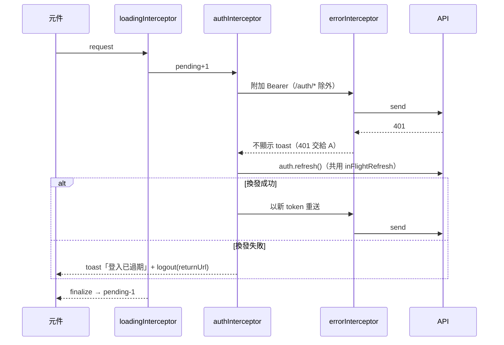

# 模組：Web（Angular 前端）

> 階段 2，模組 6。盤點日期 2026-09-26（commit `61b1f5d`）。
> 範圍：`web/` 下所有非測試檔。包含設定（`package.json`、`angular.json`、`tsconfig*.json`、`proxy.conf.json`、`.vscode/*`）、`src/{index.html,main.ts,styles.css}`、`src/app/**`，共 45 個 `.ts`，另有 31 個 `*.spec.ts` 未讀。
> 容器與 nginx 已在 `17-module-platform-infra.md` 說明。各功能頁的業務細節已分別寫在模組 1 到 5，本文著重在**整體結構、橫切機制、與後端 DTO 的對應**，細節只引用不重複。
> 以下路徑省略 `web/src/app/` 前綴；後端路徑省略 `src/MyCollection.` 前綴。

## 技術基線

| 項目 | 值 | 證據 |
|---|---|---|
| Angular | 20.3（standalone、signals、`provideZoneChangeDetection({ eventCoalescing: true })`，仍使用 zone.js） | `package.json`、`app.config.ts` |
| 語言設定 | TypeScript 5.9，`strict`、`strictTemplates`、`noPropertyAccessFromIndexSignature`；**未開** `noUncheckedIndexedAccess`（`catalog.component.ts` → `filterValue` 的註解明白寫出這個取捨） | `tsconfig.json` |
| Build | `@angular/build:application`，production budget：initial 500kB 警告、1MB 錯誤 | `angular.json` |
| 測試 | Karma + Jasmine（需要 `CHROME_BIN`） | `angular.json` → `test` |
| 狀態管理 | 沒有 NgRx，全部是 `providedIn: 'root'` 的 service 加上 signal | `core/*.service.ts` |
| Runtime 設定 | `index.html` 載入 `config.js`，由容器 entrypoint 以 `envsubst` 產生，寫入 `window.__MYCOLLECTION_CONFIG__.apiBase`；缺值時退回 `/api` | `core/api-base.ts` → `resolveApiBase`；`web/docker-entrypoint.d/40-runtime-config.sh` |
| 開發代理 | `ng serve` 把 `/api` 轉到 `localhost:5080`，並去掉前綴 | `proxy.conf.json` |

## 路由

| Path | 元件（全部 `loadComponent` 懶載入） | Guard | 備註 |
|---|---|---|---|
| `/login` | `LoginComponent` | — | 登入與註冊切換；成功後 `navigateByUrl(returnUrl ?? '/')` |
| `/p/:slug` | `PublicShareComponent` | — | `data.publicShell = true`，`App` 會隱藏導覽列 |
| `/` | `ShowcaseComponent` | `authGuard` | `?view=` 以 `withComponentInputBinding()` 綁到 `input()` |
| `/catalog` | `CatalogComponent` | `authGuard` | 篩選條件的真實來源是 URL（ADR-0010） |
| `/items/new`、`/items/:id` | `ItemDetailComponent` | `authGuard` | 同一個元件 |
| `/categories` | `CategoriesComponent` | `authGuard` | — |
| `/settings` | `SettingsComponent` | `authGuard` | — |
| `**` | 導回 `''` | — | — |

證據：`app.routes.ts`。`authGuard` 只檢查 session 是否存在，不檢查 access token 是否過期；過期交給 interceptor 換發處理。
證據：`core/auth.guard.ts`

## 橫切機制

### HTTP 攔截器鏈

依序為 `loadingInterceptor` → `authInterceptor` → `errorInterceptor`。loading 放最外層，所以 401 → 換發 → 重送會算在同一次計數內。
證據：`app.config.ts` 註解

- **auth**：同一時間只允許一次換發，其他請求共用同一個 promise，避免 rotation 讓並行請求互相作廢。
  證據：`core/auth.service.ts` → `refresh` 的註解
- **error**：
  - 把 ProblemDetails 轉成 toast。有 `errors` 時列出每個欄位的訊息，否則依序顯示 `detail`、`title`，最後才用 HTTP 狀態碼。
  - 401 和 `/auth/refresh` 失敗不顯示 toast。
  - 元件以 `IGNORE_HANDLED_BY_INTERCEPTOR` 表明「錯誤已處理」。
  - 證據：`core/error.interceptor.ts`
- **loading**：全站計數，超過 200ms 才顯示進度條；讀取計數時用 `untracked`，避免在 effect 裡發出的請求形成無限迴圈（註解有說明）。
  證據：`core/loading.service.ts`

### 狀態與持久化

| 狀態 | 位置 | 儲存 | 證據 |
|---|---|---|---|
| Session（access token、refresh token、user） | `AuthService.session` signal | `localStorage['mycollection.session']`，**沒有跨分頁同步** | `core/auth.service.ts` |
| 庫存返回點（篩選 key、頁數、錨點） | `CatalogReturnPointService` | `sessionStorage`，讀回時做形狀驗證 | `core/catalog-return-point.service.ts` → `isReturnPoint` |
| Provider 能力清單 | `ProviderService.providers` signal | 記憶體；**第一次被注入時探測一次**，失敗就視為空清單 | `core/api/provider.service.ts` |
| Toast | `NotificationService` | 記憶體，6 秒後自動消失 | `core/notification.service.ts` |
| 頁面狀態 | 元件內 signal | URL（`/catalog` 的篩選條件、`?view=`） | `core/catalog-query.ts`、`shared/showcase-tabs/showcase-view.ts` |

### 私有媒體載入

`AuthenticatedMediaDirective` 只對 `${API_BASE}/media/` 開頭的 URL 用 HttpClient 取 blob（讓 interceptor 附加 token），轉成 object URL，並在銷毀時 revoke。其他 URL（外部 CDN、公開分享的媒體）直接交給瀏覽器，**避免把 token 送到第三方**。
證據：`shared/authenticated-media.directive.ts`

## API 層與後端 DTO 對應

每個資源一個 service，全部以 `API_BASE` 組 URL；型別集中在 `core/models.ts`，是手寫的鏡像型別，不是由 OpenAPI 產生。

| 前端型別 | 後端 record | 對應狀況 |
|---|---|---|
| `UserDto`、`AuthResponse` | `Application/Auth/AuthDtos.cs` | 一致 |
| `CategoryDto`、`CategoryFieldDto`、`RenameFieldResultDto` | `Application/Categories/CategoryDtos.cs`、`RenameCategoryFieldCommand.cs` | 一致。`FieldType` 與 `DisplayMode` 的字面值和 Domain enum 相同 |
| `ItemDto` | `Application/Items/ItemDtos.cs` | **`source` 少了 `'Psn'`**（Domain `ItemSource` 有 `Psn`，即 C9） |
| `ItemWritePayload`（寫入時 acquisition 是扁平結構，讀取時是巢狀） | `CreateItemCommand`／`UpdateItemCommand`、`AcquisitionInput` | 形狀一致。**前端從不送 `locationId`**，見 W6 |
| `ShareLinkDto`、`PublicItemDto`、`PublicShareDto` | `Application/Sharing/ShareDtos.cs` | 一致（`PublicImageDto` 以 inline 型別表示） |
| `SyncJobDto` | `Application/Ingestion/SyncCommand.cs` | 一致。`status` 三個值與 `SyncStatus` 相同 |
| `ProviderDto.capabilities` | `IngestionEndpoints` → `ProviderCapabilities.Of(p).ToString()` | 依賴 `[Flags]` enum `ToString()` 的輸出格式 `"A, B"`，前端 `split(',')`；沒有型別保護 |
| `ExternalAccountDto`、`FetchedMetadataDto`、`ImageImportResultDto` | 對應 record | 一致 |
| `ProblemDetails` | `GlobalExceptionHandler` | 一致 |

【推論】唯一的型別漂移是 `source`（C9）。其餘靠人工同步，目前沒有機制能讓漂移在編譯期被發現。後端已經有 `AddOpenApi()`，但只在 Development 環境 `MapOpenApi`，前端也沒有使用產生器。

## 風險與觀察

| # | 觀察 | 嚴重度 | 證據 | 影響與建議方向 |
|---|---|---|---|---|
| W1 | **多開分頁或多裝置時會互相登出** | 高（Q26 後由中升級） | `AuthService` 只在建構時從 `localStorage` 還原一次，沒有監聽 `storage` 事件；`logout` 會 `localStorage.removeItem`。後端 refresh 是 rotation 而且一個帳號只有一組 session（`11-module-identity.md` I5、I11） | 分頁 A 換發後，分頁 B 記憶體裡還是舊的 refresh token。B 的 access token 過期（30 分鐘）後拿舊 token 換發會得到 403，接著 logout **並清掉 localStorage 裡 A 的新 session**，A 下次重新整理也會被登出。手機登入同樣會讓桌機的 session 失效。建議方向：監聽 `storage` 事件同步 session，或在後端支援多 session（見 Q26） |
| W2 | **登入後的精選頁「遊戲成就」背景圖，只要品項有上傳或已下載的圖片就會載不出來** | 中 | `shared/showcase-sections/stats-section.component.ts` 用 `[style.background-image]` 直接套 `item.imageUrl`。內部頁的 `imageUrl` 是 `${API_BASE}/media/...`（`showcase-display-item.ts` → `coverImageUrl`），而 CSS 背景請求不會帶 Bearer，所以回 401。設為精選的 Steam 遊戲會被 `ShowcaseImageDownloader` 寫入本機圖片（`Infrastructure/Imaging/ShowcaseImageDownloader.cs` → `Update.Push(x => x.Images, …)`），之後 `imageUrl` 就改指向 `/media` | 公開分享頁不受影響（走公開媒體 URL）。沒有圖片、使用 CDN `headerUrl` 的品項也正常。也就是說，**正是精選的遊戲**會變成黑底。其他分區都用 `AuthenticatedMediaDirective`，只有 Stats 漏掉。建議方向：改用這個 directive，它已支援 `backgroundImage` |
| W3 | 精選頁載入失敗時顯示「還沒有精選品項」 | 低 | `features/showcase/showcase.component.ts` → `fetchPage` 的 `error: () => this.loading.set(false)`，接著模板走 `items().length === 0` 分支 | 與 `17-module-platform-infra.md` P13（no available instance）疊加時，使用者會同時看到錯誤 toast 和「你沒有精選」的空狀態，容易誤以為資料不見了 |
| W4 | `ProviderService` 只探測一次，而且把失敗當成「沒有 provider」 | 低 | `core/api/provider.service.ts` 建構子加 `catchError(() => of([]))` | 第一次探測若碰上暫時性錯誤（P13 這類），IGDB 和 Steam 補完的入口會一直隱藏到重新整理為止，使用者看不出原因 |
| W5 | 刪除品類後，dialog 沒有關閉 | 低 | `features/categories/categories.component.ts` → `remove` 的 `next` 只 `draft.set(null)`，沒有呼叫 `dismiss()`；dialog 的內容包在 `@if (draft())` 裡 | 刪除成功後畫面上會留下一個空的 modal 框，只能按 Esc 關掉。`save` 則有正確呼叫 `dismiss()` |
| W6 | `locationId` 是半死的欄位 | 低 | 前端 `ItemWritePayload.locationId` 是 optional，`item-detail.component.ts` → `toPayload` 從不設定；後端 `UpdateItemCommandHandler` 每次都寫入 `existing.LocationId = ToLocationId(..., request.LocationId)` | 只要透過 API 設過 `locationId`，下一次在 UI 儲存就會被清成 null，而且整個 UI 都沒有這個欄位。建議方向：移除，或補上 UI（與 ADR-0008 的 `storageLocation` 釐清關係） |
| W7 | 拼貼牆可能出現重複的 track key | 低 | `shared/showcase-sections/collage-section.component.ts` → `replaceRandomSlot` 從 pool 依序取下一件，放進隨機一格，但沒有檢查那件是否已在其他格；模板使用 `track slot.item.id` | 精選數量略多於槽位數（例如 9 件、8 格）時，同一件品項可能同時出現在兩格，Angular 會出現重複 key 警告（NG0955）並錯誤地重用 DOM |
| W8 | 公開分享頁把所有錯誤都顯示成「連結不存在」 | 低 | `features/public/public-share.component.ts` → `error: () => this.notFound.set(true)` | 500、連線失敗、P13 都會被說成「已被刪除或過期」，訪客與擁有者都會被誤導。另外 `share.service.ts` → `getPublic` 的註解說「interceptor 不會附加 token」，但 `authInterceptor` 只要有 token 就會附加（登入者開自己的分享頁時）。行為無害，註解與實作不符 |
| W9 | `DynamicFormComponent` 每次重建表單都新增一個 `valueChanges` 訂閱，而且不取消舊的 | 低 | `shared/dynamic-form/dynamic-form.component.ts` 建構子內的 `effect` | 舊的 `FormGroup` 已不再被使用，所以實際上不會多發事件，只是少量記憶體無法回收。另外，表單重建本身不會觸發 `valueChanges`，這導致呼叫端必須自己再過濾一次（`item-detail.component.ts` → `declaredOnly` 的註解），也是 C1 的成因之一 |
| W10 | 沒有 CSP，token 放在 localStorage | 低（本模組） | `index.html` 沒有 meta CSP；`web/nginx.conf` 沒有 header | 已記錄為 `11-module-identity.md` I3 與 `17-module-platform-infra.md` P9。模板中沒有任何 `innerHTML` 或 `bypassSecurityTrust*`，XSS 面相對小 |

> 已在其他模組記錄、這裡不重複的前端問題：C1（`declaredOnly` 會刪除未宣告的屬性）、C3（Date `slice(0,10)`）、C9（`source` 缺 `Psn`）、C11（搜尋沒有 debounce，`catalog.component.ts` → `applySearch` 每次按鍵都導航並查詢）、M1（`uploadImages` 並行上傳）、M8（匯出整包 blob 放在記憶體）、M9（uploader 的 `busy` 從未設定）、S7（外部 CDN 圖片）。

### 做得好的地方

- **URL 是狀態的真實來源**：`catalog-query.ts` 對每個 query param 做形狀收斂，壞值不會讓畫面壞掉。`catalogQueryKey` 用 JSON 而不是字串拼接，避免使用者輸入的 `&`、`=` 讓兩組條件壓成同一個 key（註解說明了這條唯一會默默出錯的路徑）。
- **競態處理有意識**：
  - 搜尋用 `latestRequest` 序號丟棄晚到的舊結果。
  - IGDB 對話框關閉後以 `takeUntil(closed)` 丟棄遲到的結果。
  - 預覽大圖用 `pendingId` 比對，丟掉不再需要的請求。
  - 換發用共用的 promise。
- **誠實的狀態回報**：enrich 在 Cloud Tasks 模式下回應 `Running`，`awaitJob` 會輪詢到結束。逾時不算失敗，而是明確告知「仍在背景處理」。`failed` 與 `skipped` 分開講（`item-detail.component.ts` → `refetchFromIgdb`）。
- **一致的 busy 鎖**：品項、品類、設定各面板都用 `busy` computed 鎖住互斥的寫入，dialog 在忙碌中不能被關閉（包括 Esc）。
- **無障礙**：頁籤實作完整的 WAI-ARIA tabs（roving tabindex、方向鍵跳過停用的頁籤）；評分列是可用鍵盤操作的 `role="slider"`；支援 `prefers-reduced-motion`；按鈕最小 44px。
- **不把 token 送給第三方**：媒體 directive 只對自家 `/media` 路徑附加 token。

## 待確認問題

（已同步到 `99-open-questions.md` 的 Q26）

- W1：你平常會同時開多個分頁，或在手機和電腦上都登入嗎？如果會，W1 在日常使用中就會發生，建議升為高並優先處理。
  - 【已回覆 2026-09-26（Q26）】會開多個分頁，很少多裝置同時登入。W1 升為高。
