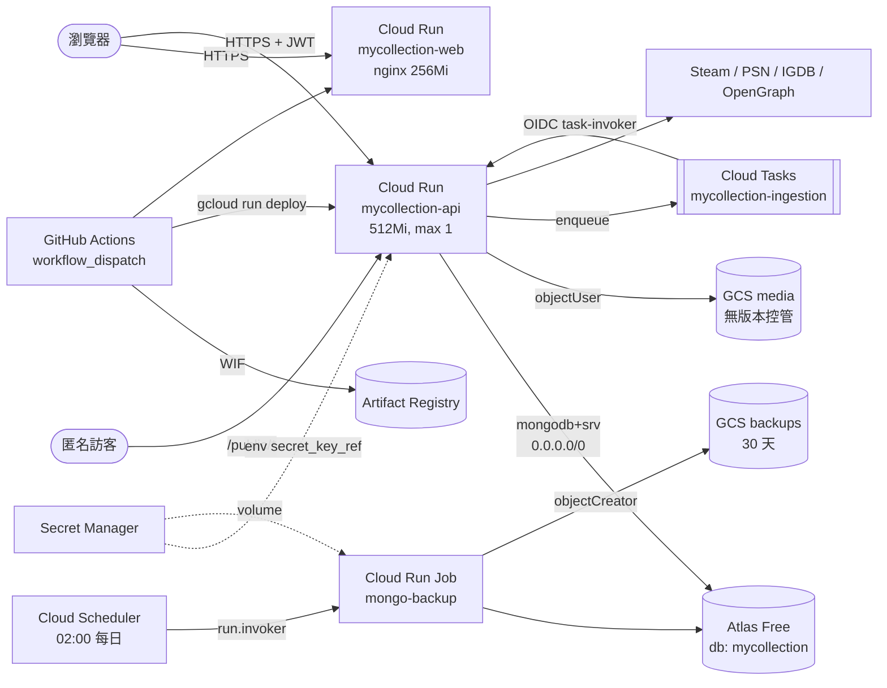
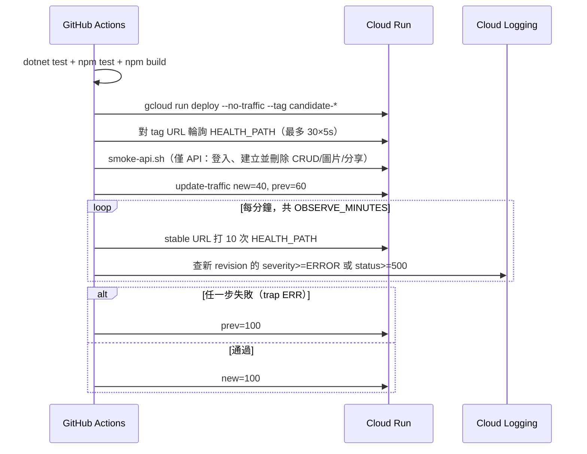

# 模組：Platform & Infra

> 階段 2，模組 7。盤點日期 2026-09-26（commit `61b1f5d`）。
> 範圍：
> - 後端平台：`Api/{Program,GlobalExceptionHandler,HttpUserContext}.cs`、`Api/{appsettings*.json,Properties/launchSettings.json,Dockerfile,*.csproj}`、`Application/DependencyInjection.cs`、`Infrastructure/DependencyInjection.cs`、`Infrastructure/Mongo/{MongoContext,MongoConventions,MongoIndexInitializer,MongoOptions,SystemCategorySeeder,SystemCategoryDefinitions}.cs`
> - Repo 根目錄：`Directory.Build.props`、`MyCollection.slnx`、`docker-compose.yml`、`.env.example`、`.dockerignore`、`.gitignore`
> - 基礎設施：`infra/terraform/{bootstrap,runtime}/*`（不含 `.terraform.lock.hcl`）、`infra/backup/*`、`infra/acceptance/*`
> - CI/CD：`.github/workflows/*`、`.github/scripts/*`
> - Web 容器：`web/{Dockerfile,nginx.conf,runtime-config.template.js,docker-entrypoint.d/40-runtime-config.sh}`
> - 交叉核對（文件，非程式碼）：`docs/deployment/{production-operations,mongodb-backup-restore-runbook}.md`、`docs/adr/0011-*.md`
>
> 以下路徑省略 `src/MyCollection.` 前綴。個人信箱、Twitch Client ID、真實使用者 ObjectId、開發用金鑰一律以 `<REDACTED>` 表示。

## 職責

1. **組裝與啟動**：註冊 BSON 慣例 → 註冊 DI → 設定 JWT、CORS、ForwardedHeaders、ProblemDetails → 對應 endpoint → 建立索引並寫入系統品類 → 標記 ready → `app.Run()`。
   證據：`Api/Program.cs`
2. **全域錯誤轉換**：整個後端只有一個地方把例外轉成 RFC 9457 ProblemDetails。
   證據：`Api/GlobalExceptionHandler.cs` → `GlobalExceptionHandler.Map`
3. **Mongo 基礎**：連線（`ServerApi V1`）、集合名稱、全域序列化慣例、索引、系統品類種子資料。
   證據：`Infrastructure/Mongo/MongoContext.cs`、`MongoConventions.cs`、`MongoIndexInitializer.cs`、`SystemCategorySeeder.cs`
4. **依設定切換實作**：Storage 在 Local 與 Gcs 之間切換，Tasks 在 InProcess 與 CloudTasks 之間切換，IGDB 缺憑證時整組不註冊。
   證據：`Infrastructure/DependencyInjection.cs` → `AddInfrastructure`
5. **正式環境基礎設施（Terraform）**：
   - `bootstrap`：啟用 API、預算告警、GitHub WIF。
   - `runtime`：Cloud Run 服務、GCS、Cloud Tasks、備份 Job、告警。
   證據：`infra/terraform/*/README.md`
6. **發布**：只能手動 `workflow_dispatch`。流程為測試 → build → push → canary（40%）→ 觀察 → 升到 100%，失敗時自動切回。
   證據：`.github/workflows/deploy-production.yml`、`.github/scripts/rollout-cloud-run.sh`
7. **備份與還原演練**：每天 02:00（Asia/Taipei）執行 `mongodump` 並上傳 GCS，保留 30 天；還原演練每季手動執行。
   證據：`infra/terraform/runtime/backups.tf`、`infra/backup/entrypoint.sh`、`infra/acceptance/restore-drill.ps1`

## 部署拓樸

證據：`infra/terraform/runtime/{services,storage,tasks,backups}.tf`、`infra/terraform/bootstrap/wif.tf`；Atlas 的網路設定見 ADR-0011。

| 元件 | 關鍵設定 | 證據 |
|---|---|---|
| `mycollection-api` | ingress ALL、`allUsers` invoker、timeout 300s、min 0／max 1、cpu 1／512Mi、`cpu_idle`、startup CPU boost。startup probe 與 liveness probe 都打 `/health/live`。`image` 與 `traffic` 列在 `ignore_changes` | `runtime/services.tf` → `google_cloud_run_v2_service.api` |
| `mycollection-web` | 同上，但 256Mi、timeout 60s，probe 打 `/` | `runtime/services.tf` → `.web` |
| 服務帳號 | `api-runtime`（讀 4 個 secret、media `objectUser`、queue enqueuer、可 actAs task-invoker）；`web-runtime`（沒有任何權限）；`task-invoker`（只有 API 的 `run.invoker`）；`backup-runner`（讀 Mongo URI、backups `objectCreator`）；`backup-scheduler`（只能呼叫備份 Job）；`github-cloud-run-deployer`（`artifactregistry.writer`、`run.admin`、`logging.viewer`） | `runtime/{services,storage,tasks,backups}.tf`、`bootstrap/wif.tf` |
| WIF | 只接受 repo `AdamChang/my-collection`、`refs/heads/master`、`workflow_dispatch` | `bootstrap/wif.tf` → `attribute_condition` |
| Cloud Tasks queue | 最多同時 1 個、每秒 1 個；重試 5 次，退避 10s 到 300s | `runtime/tasks.tf` |
| GCS | media 與 backups 都是 uniform access、public access prevention `enforced`、`prevent_destroy`；backups 另有 lifecycle `age=30` 刪除 | `runtime/{storage,backups}.tf` |
| Artifact Registry | 保留最近 20 個版本；超過 30 天刪除 | `runtime/artifacts.tf` |
| 預算 | TWD 150（50／90／100% 通知）、TWD 300（100% 通知） | `bootstrap/budget.tf` |
| 告警 | (1) api 或 web 的 5xx 次數 > 0，以 5 分鐘對齊，`auto_close` 1800s；(2) 備份 Job 的 log `severity>=ERROR` | `runtime/alerts.tf`、`runtime/backups.tf` |
| Terraform state | GCS backend `mycollection-504914-tfstate`，兩個 root 用不同 prefix | `*/versions.tf` |

**本機／自架拓樸**：`docker-compose.yml` 只有 `api`（`ASPNETCORE_ENVIRONMENT=Production`、`Storage=Local` 掛 `./data/media`、Tasks 用預設 InProcess）與 `web`。**不包含 Mongo**，連線字串由 `.env` 提供。
證據：`docker-compose.yml`；`appsettings.json`（`Tasks:Provider = InProcess`）

## 啟動流程

| 順序 | 動作 | 為什麼放在這裡 | 證據 |
|---|---|---|---|
| 1 | `MongoConventions.Register()` | 必須早於任何 BSON 序列化。`BsonClassMap` 會永久快取，太晚註冊會讓整個行程改用 PascalCase，owner filter 因此查不到資料 | `Program.cs` 註解；`MongoConventions`（lock + 旗標最後才設）；`MongoContext` 建構子會再呼叫一次（冪等） |
| 2 | 靜音 MediatR 授權警告 | 註解寫明「個人非營利用途」 | `Program.cs` → `AddFilter("LuckyPennySoftware.MediatR.License", LogLevel.None)` |
| 3 | `AddApplication`／`AddInfrastructure` | 設定錯誤（Storage 缺 Bucket、CloudTasks 缺 4 個參數、不支援的 provider）**在這一步就拋例外** | `Infrastructure/DependencyInjection.cs` |
| 4 | `IUserContext` = `ScopedUserContext(Background, Http)` | 延後到實際存取時才決定用哪個身分（詳見 `11-module-identity.md`） | `Program.cs` |
| 5 | JWT：`MapInboundClaims=false`、同時清空 `DefaultInboundClaimTypeMap`、`ClockSkew` 30s | 讓 `HttpUserContext` 讀到原始的 `sub` | `Program.cs`；`HttpUserContext.UserId` |
| 6 | `FormOptions.MultipartBodyLengthLimit = long.MaxValue` | 為了匯入端點（M5，Q22 已決定不需要此功能） | `Program.cs` 註解 |
| 7 | Middleware：ForwardedHeaders → ExceptionHandler → CORS → AuthN → AuthZ | — | `Program.cs` |
| 8 | OpenAPI 只在 Development 環境對應 | — | `Program.cs` → `MapOpenApi` |
| 9 | `EnsureIndexesAsync` → `SystemCategorySeeder.SeedAsync` | **每次冷啟動**都會對正式 DB 執行（見 P4） | `Program.cs`；`MongoIndexInitializer`；`SystemCategorySeeder` |
| 10 | `StartupHealthState.MarkReady()` → `app.Run()` | — | `Program.cs` |

### 設定來源

| 區段 | appsettings 預設 | 正式環境來源 | 證據 |
|---|---|---|---|
| `Mongo:ConnectionString` | `mongodb://localhost:27017` | Secret Manager `mongo-connection-string`（`<REDACTED>`） | `appsettings.json`、`services.tf` |
| `Mongo:Database` | `mycollection` | env `mycollection` | 同上 |
| `Jwt:Key` | 空字串（Development 另有一把開發用 key：`<REDACTED>`） | Secret Manager `jwt-signing-key` | `appsettings*.json`、`services.tf` |
| `SecretProtection:Key` | 空字串（Development：`<REDACTED>`） | Secret Manager `secret-protection-key` | 同上 |
| `Storage:*` | `Local`、`data/media` | `Gcs` + bucket 名稱 | 同上 |
| `Tasks:*` | `InProcess` | `CloudTasks` + ProjectId、HandlerUrl（`{api_public_url}/internal/tasks/ingestion`）、Audience、SA email | 同上 |
| `Igdb:*` | 空字串 | ClientId 走一般 env（`<REDACTED>`，Terraform 註解說明這是公開識別碼），Secret 走 Secret Manager；`igdb_enabled` 預設 true | `services.tf`、`variables.tf` |
| `Cors:AllowedOrigins` | 無（不設定就沒有任何 origin 會被允許） | `web_public_url` | `Program.cs`、`services.tf` |
| 開發環境機密 | — | user secrets（`UserSecretsId`） | `Api/MyCollection.Api.csproj` |

`Directory.Build.props` 對所有專案開啟 `TreatWarningsAsErrors` 與 `InvariantGlobalization`；`Api.csproj` 另外釘住 `Microsoft.OpenApi 2.12.2`，以避開 GHSA-v5pm-xwqc-g5wc。

## 錯誤處理

| 例外 | HTTP | `detail` | log 等級 |
|---|---|---|---|
| `ValidationException` | 400 | 無，改放 `errors` 字典（依 PropertyName 分組） | Information |
| `InvalidImageException`／`InvalidArchiveException` | 400 | exception message | Information |
| `NotFoundException` | 404 | message | Information |
| `ForbiddenException` | 403 | message | Information |
| `ConflictException`／`UnreadableCredentialException` | 409 | message | Information |
| `ProviderException` | 502 | message（title 帶 `ProviderKey`） | Information |
| 其他 | 500 | 無（不外洩） | **Error**（含 stack） |

證據：`GlobalExceptionHandler.Map`、`TryHandleAsync`。`Instance` 欄位固定是 `"{Method} {Path}"`。
【推論】`ProviderException` 會把上游的錯誤訊息原樣回給前端，與 `15-module-ingestion.md` R5（例外訊息寫進 job 錯誤）同一類問題。

## Mongo 基礎

- **全域慣例**：camelCase、`IgnoreExtraElements(true)`、enum 存字串、`decimal` 存 `Decimal128`。
  證據：`MongoConventions.Register`
- **`UtcOnlyDateTimeSerializer`**：寫入時只要 `DateTime.Kind` 不是 Utc 就拋例外。這是刻意在寫入當下讓錯誤爆出來，避免 UTC+8 機器把 Unspecified 當成本地時間，默默存成前一天。
  證據：`MongoConventions.cs` → `UtcOnlyDateTimeSerializer` 類別註解
- **索引**（啟動時建立，同名同定義冪等）：

| 集合 | 索引 | 說明 |
|---|---|---|
| `users` | `ux_users_email`（unique）、`ix_users_refreshTokenHash`（sparse） | — |
| `categories` | `ix_categories_owner`（ownerId, name） | — |
| `items` | `ix_items_showcase`、`ix_items_category`、`ix_items_tags`、`ux_items_externalRef`（**partial** unique）、`tx_items_text`（name + description） | 註解說明為什麼用 partial 不用 sparse：複合索引的 sparse 會讓手動品項以 `(ownerId, null, null)` 互撞 |
| `shareLinks` | `ux_shareLinks_slug`（unique） | — |
| `externalAccounts` | `ux_externalAccounts_owner_provider`（unique） | — |
| `syncJobs` | `ix_syncJobs_owner_startedAt` | — |

證據：`MongoIndexInitializer.EnsureIndexesAsync`
- **系統品類**：6 個固定 ObjectId（`…01` 到 `…06`：實體遊戲、數位遊戲、音樂專輯、電影光碟、公仔模型、珍藏卡）。以 `UpdateOne` + upsert 用 `$set` **每次啟動覆寫** name、icon、kind、fields、defaultDisplayMode；`createdAt` 只在第一次寫入（`SetOnInsert`）。
  證據：`SystemCategorySeeder.SeedAsync`、`SystemCategoryDefinitions.Create`

## 發布流程

證據：`.github/scripts/rollout-cloud-run.sh`、`.github/scripts/smoke-api.sh`、`.github/workflows/*.yml`

- `deploy-production.yml` **依序部署 API 與 Web**（API 觀察 15 分鐘，之後才開始 Web）。`deploy-web-production.yml` 只部署 Web（觀察 10 分鐘），而且**不執行前端測試**。兩個 workflow 共用同一個 concurrency group，`cancel-in-progress: false`。
- 部署 identity 是 WIF 換來的短期憑證，repo 內沒有長期金鑰。smoke 測試帳號的密碼來自 `secrets.PRODUCTION_SMOKE_PASSWORD`。
- Terraform 不負責流量：`image` 與 `traffic` 都列在 `ignore_changes`。`variables.tf` 中的 image digest 是刻意留下的失效佔位值。
  證據：`runtime/README.md`；`docs/deployment/production-operations.md`「terraform apply 的注意事項」

## 備份與還原

- **備份**：Cloud Scheduler 用 OAuth token 呼叫 Job 的 `:run`。Job 以 volume 掛載 Mongo URI，寫進 `umask 077` 的 config 檔，`mongodump --archive --gzip`，再用 metadata server 的 token 以 `ifGenerationMatch=0` 上傳，不會覆寫既有物件。mongodump 的 stderr 會先經過 `redact_uris` 遮蔽帳密才輸出。
  - 這個遮蔽是 2026-08-16 URI 外洩事件後加上的。依 runbook 描述，那次事件同時證實了告警路徑可以送達。
  - 證據：`infra/backup/entrypoint.sh`；`docs/deployment/mongodb-backup-restore-runbook.md` 末段
- **權限最小化**：`backup-runner` 只有 `objectCreator`，無法刪除或覆寫既有備份。image 以 non-root 的 `mongobackup` 使用者執行。
  證據：`backups.tf` → `data.google_iam_policy.backups`；`infra/backup/Dockerfile`
- **還原演練**：
  - 在本機 Docker 執行，URI 經 stdin 寫入 tmpfs。
  - 目標庫名稱必須符合 `mc-r-<UTC>-<hex8>` 格式，不能是 `mycollection`，長度小於 38。
  - 不使用 `--drop`。
  - 比對 collection 涵蓋率與 index 是否建立；counts 的差異只標示，不判定失敗。
  - 暫時庫需要手動到 Atlas UI 丟棄。
  - 證據：`infra/acceptance/restore-drill.ps1`、`restore-drill-container.sh`
- **Phase 7 驗收腳本**：驗證匿名請求沒有越權。會以匿名身分讀 `/media`、`/items`，直讀 GCS 物件並列舉 bucket，也檢查 share 範圍內外的圖片。
  證據：`infra/acceptance/phase7-acceptance.ps1`

## 風險與觀察

| # | 觀察 | 嚴重度 | 證據 | 影響與建議方向 |
|---|---|---|---|---|
| P1 | **媒體沒有任何備份或版本控管** | 中 | `runtime/storage.tf`（media bucket 沒有 `versioning` 或 `soft_delete_policy` 區塊）；`production-operations.md` 儲存表格寫「無版本控管」；備份 Job 只 dump Mongo | 誤刪、程式 bug（例如 `DeletePrefixAsync` 的前綴錯誤）或操作失誤造成的圖檔損失都無法回復。把 Mongo 還原到較早的快照後，舊資料指向的圖片可能也已不存在。建議方向：開啟 object versioning 或明確的 soft delete 保留期，或把 media 納入備份（見 Q24） |
| P2 | **【推論】API 的應用程式 log 在 Cloud Logging 可能沒有 severity**。若屬實，canary 與告警都看不到 `LogError` | 中 | `Program.cs` 沒有 `AddJsonConsole`，`appsettings.json` 也沒有設定 Console formatter，所以使用預設的 simple console logger，全部寫到 stdout。canary 條件是 `severity>=ERROR OR httpRequest.status>=500`（`rollout-cloud-run.sh`）。對照組是備份 Job：它寫 **stderr**，而告警確實觸發過（runbook） | 推論依據：Cloud Run 只會從 JSON 的 `severity` 欄位解析等級，純文字 stdout 不會被視為 ERROR。影響：(1) canary 只能靠 5xx 判定；背景工作（`ShowcaseImageDownloader`、Cloud Tasks handler 內部已吞掉的失敗）的錯誤不會讓 canary 回滾。(2) 目前只有 5xx metric 告警，背景失敗完全無聲。建議方向：改用含 `severity` 欄位的 JSON console 輸出，並補背景失敗的告警（見 Q23） |
| P3 | **啟動時對正式 DB 做結構變更，canary 回滾不會復原** | 低 | `Program.cs` 在 `app.Run()` 前執行 `EnsureIndexesAsync` 與 `SeedAsync`；`gcloud run deploy --no-traffic` 仍會啟動新 revision | 新 revision 一啟動（0% 流量時）就會建立新索引、覆寫系統品類的 `fields`。canary 失敗時流量切回舊版，資料面的變更卻保留，舊版會讀到新定義。另外，每次冷啟動（min 0）都會對 Atlas 執行 8 次建立索引加 1 次 bulk upsert，拉長首個請求的延遲。建議方向：與程式碼版本相容性一起考量，或改為部署步驟 |
| P4 | **沒有 PR 或 push 觸發的 CI；只部署 Web 的 workflow 完全不跑測試** | 低 | `.github/workflows/` 只有兩個 `workflow_dispatch` 檔；`deploy-web-production.yml` 只有 `npm ci && npm run build` | 測試只在正式部署那一刻執行。merge 進 master 的變更可能長期沒被驗證（例如 `aa907b0` 這類 web 修正若走 Web 專用 workflow，就不會跑測試）。建議方向：新增 PR 觸發的 test workflow；Web 部署補上 `npm test` |
| P5 | **同一個 workflow 依序部署 API 與 Web，可能只成功一半** | 低 | `deploy-production.yml`：API canary 通過並升到 100% 後，才開始 Web canary | Web 失敗時會回滾 Web，但 API 已是新版。若這次變更前後端互相依賴（DTO 改名等），線上會出現版本錯配。另外 `production-operations.md` 把這個 workflow 描述為「API」，與實際不符（文件漂移） |
| P6 | **【推論】canary 期間同時有兩個 revision，「max 1 ⇒ 單一實例」的假設不成立** | 低 | `max_instance_count = 1` 是**每個 revision** 的上限；rollout 期間 40/60 分流最長 15 分鐘 | 每個實例各自持有 in-process singleton：`SteamStoreRateLimiter`、`IgdbRateLimiter`、`TwitchTokenProvider` 快取、`ShowcaseImageQueue`。節流被分成兩份，精選圖片佇列只處理送進自己實例的工作。Cloud Tasks 的 queue 並行度是 1，所以背景同步不受影響；互動式請求（例如 `/ingest/fetch`、單筆補完）則可能同時打到兩個實例 |
| P7 | **【推論】workflow 被取消或逾時時，流量可能卡在 40/60** | 低 | `rollout-cloud-run.sh` 只設定 `trap rollback ERR`；GitHub 取消時送 SIGTERM／SIGKILL，不會觸發 ERR | 下一次部署會因為找不到 100% 的 baseline 而拒絕執行（腳本的防呆），需要手動 `update-traffic`。建議方向：同時 trap `TERM`／`INT` |
| P8 | **`/health/startup` 實際上不可能回 503** | 低 | `Program.cs`：`MarkReady()` 在 `app.Run()` 之前呼叫，而 Kestrel 在 `app.Run()` 才開始監聽；`MarkNotReady()` 只有 `tests/…/ProductionBaselineTests.cs` 用到；Cloud Run 的 startup probe 打的是 `/health/live`（`services.tf`） | 行為本身正確（沒 ready 就沒在監聽），但維運文件描述的「等索引與 seeding 完成」其實是由「還沒開始監聽」達成的，不是這支 endpoint。canary 用 `/health/startup` 作為 HEALTH_PATH，與 `/health/live` 等效，兩者都不檢查 Mongo 是否可連 |
| P9 | **Web 容器設定有殘留，而且沒有安全 header** | 低 | `web/nginx.conf`：`client_max_body_size 2g`，註解提到 `/api/import`，但沒有任何 `proxy_pass`；`web/Dockerfile` 的 `API_BASE_URL=/api` 預設值因此無法使用（compose 與 Terraform 都有覆寫）；沒有 CSP、`X-Frame-Options` 等 header | 殘留設定會誤導閱讀者。缺少 CSP 與 `11-module-identity.md` I3（token 放 localStorage）疊加。【推論】`nginx:alpine` 預設以 root 啟動 master process，而 API image 使用 `$APP_UID` |
| P10 | **git 追蹤的檔案中有個人識別資料** | 低 | `runtime/variables.tf`：`storage_operator_email`、`backup_alert_email`、`service_alert_email` 的 default 都是個人信箱（`<REDACTED>`）；`phase7-acceptance.ps1` 的 `$CrossRevisionMediaPath` 含有真實的 user、item、image ObjectId（`<REDACTED>`） | 與 `bootstrap/README.md`「不要把個人值放進受追蹤的 tfvars」的原則不一致（bootstrap 的 `budget_email` 就沒有 default）。建議方向：改用 `TF_VAR_*` 或不受追蹤的 tfvars |
| P11 | **`ForwardedHeaders` 信任任何來源** | 低 | `Program.cs`：`KnownIPNetworks.Clear()`、`KnownProxies.Clear()`、`ForwardLimit = 1` | 【推論】在 Cloud Run 上，最後一跳由 Google 前端附加，取 1 跳是正確的。但 `docker-compose.yml` 把 API 直接暴露在 5080，客戶端可以偽造 `X-Forwarded-For` 與 `X-Forwarded-Proto`。目前沒有功能依賴 `RemoteIpAddress`；**若未來為 I1 以 IP 分區做 rate limiting，這裡會成為繞過點** |
| P12 | **GitHub Actions 以 tag 釘版，deployer 有 `run.admin`** | 低 | `uses: actions/checkout@v4`、`google-github-actions/auth@v3` 等；`bootstrap/wif.tf` → `roles/run.admin` | 單人 repo 的供應鏈風險低。`run.admin` 包含修改服務 IAM 的權限，比「部署 revision」所需更寬。README 聲明 deployer 不能管理 project IAM，這點成立 |
| P13 | **正式環境出現「no available instance」的 500（使用者提供的 log，2026-08-27）** | 中 | Cloud Run request log（`logName` = `run.googleapis.com/requests`）：`OPTIONS /showcase?page=1&pageSize=200` 回 500，`latency 0s`，文字為「The request was aborted because there was no available instance」，revision 為 `mycollection-api-run-32749490889-1`；`services.tf` → `max_instance_count = 1` | 失敗的是 CORS 預檢，瀏覽器會把它當成 CORS 錯誤，首頁牆面直接載不出來，同時也會觸發 5xx 告警。【推論】原因候選：(a) 唯一的實例正在冷啟動或被替換（當天是 IGDB 啟用與 revision 切換的日子，見 `runtime/README.md`）；(b) 唯一的實例被長請求或高記憶體工作佔滿，或因 OOM 重啟（`15-module-ingestion.md` R2、`13-module-media-transfer.md` M3／M4）。`max 1` 讓任何一種情況都直接變成對外失敗。建議方向：先統計這類紀錄的頻率與時間點，再決定是否放寬 `max_instance_count`，或把重工作移出請求路徑 |

### 做得好的地方

- **沒有長期金鑰**：部署走 WIF，而且條件同時綁 repo、branch、event。執行時的機密全部走 Secret Manager 的 `secret_key_ref` 或 volume，repo 裡只有空白 placeholder（`.env.example`、`appsettings.json`）。
- **備份腳本的機密處理非常細緻**：URI 不進 argv、不進環境變數；錯誤輸出先遮蔽再印；上傳用 `ifGenerationMatch=0`；runner 只能建立物件。還原腳本多層防呆，避免誤覆寫正式庫。
- **失敗前移**：設定缺漏在 DI 註冊時就拋例外；`UtcOnlyDateTimeSerializer` 在寫入時就擋下錯誤的時間；`TreatWarningsAsErrors`；Terraform 對 image digest 與 URL 格式做 validation。
- **不可回復的資源都有保護**：Cloud Run 服務、兩個 bucket、Artifact Registry 都設了 `prevent_destroy` 或 `deletion_protection`；必要 API 設 `disable_on_destroy = false`。
- **授權邊界有正反兩面的驗收**：驗收腳本同時斷言「範圍內應可讀」與「範圍外應拒絕」，註解說明只做單向斷言證明不了什麼。
- **註解記錄決策理由**：partial 與 sparse 的差異、告警為什麼用 5xx 而不用 severity、`auto_close` 為什麼必要、IGDB 兩個變數為什麼必須同時設定，都寫在程式碼旁邊。

## 待確認問題

（已同步到 `99-open-questions.md` 的 Q23–Q25）

- P2：在 Logs Explorer 查 `mycollection-api` 的 `severity>=ERROR`，能不能看到應用程式自己記錄的例外（不是 Cloud Run 的 request log）？
  - 【部分回覆 2026-09-26（Q23）】提供的 ERROR 紀錄是 Cloud Run 平台的 request log（`run.googleapis.com/requests`），不是應用程式 stdout，因此 P2 仍未驗證；待查 `logName` 為 `…/run.googleapis.com%2Fstdout` 的紀錄。該紀錄本身另成觀察 P13。
- P1：media bucket 實際上有沒有 soft delete（GCS 對新 bucket 可能預設開啟，但 Terraform 沒有宣告）？圖片需不需要備份？
  - 【已回覆 2026-09-26（Q24）】計畫把圖片備份到 Google Drive。P1 維持列入技術債，直到備份上線。
- MediatR 14 的授權：程式註解以「個人非營利」為由靜音授權警告。這個前提是否確認過符合授權條款？
  - 【已回覆 2026-09-26（Q25）】使用者確認符合授權條款。
